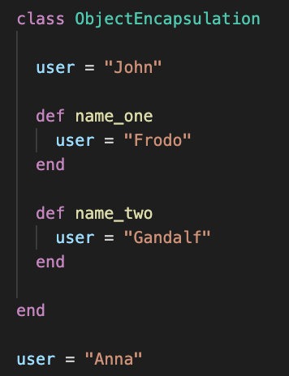
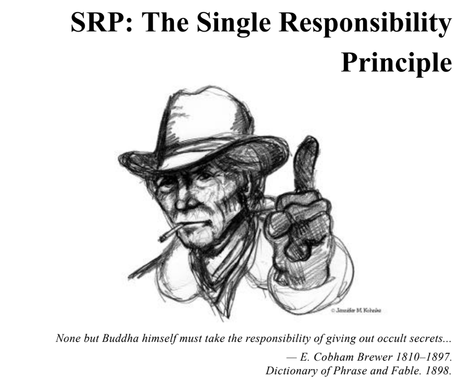
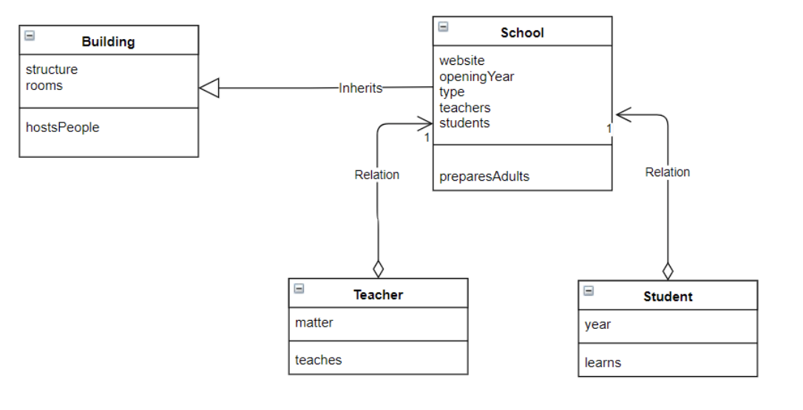

# Week 1 Goals 

- Test-driven a simple program using objects and methods
- Pair using the driver-navigator style
- Follow an effective debugging process
- Describe some basic OO principles like encapsulation, SRP

## Daily Goals 
### Wednesday 15 of April 2020

## Morning Goals 

*Be able to explain what is **encapsulation**, why and where it is used.*

**Plan:**

- Perform research on-line individually. 
- Discuss research findings in group.  
- Describe what is **encapsulation** and its usage. 
- Give some practical example for encapsulation.

**What we learned:**   
> - Encapsulation process is an important part of programming and it can be defined as wrapping up data under a single unit.   
- To **"encapsulate"** means to enclose variables, functions or methods into a small group or object.  
- **Encapsulation** in OOP is commonly done by *“wrapping”* up objects into classes by changing the scope of these objects (or/and simply hiding the data by preventing "data pollution").

<p align="center">
      
    *Object Encapsulation* 
</p>

>**Encapsulation** can be illustrated as per the example above, where we have defined class object named *"ObjectEncapsulation"* and a variable defined below it. In all cases, the same variable name has been used (as well as the same variable "user" in class been defined three times).  
By defining a new instance of the class *"ObjectEncapsulation"* and calling methods defined in the class, as per above, we getting different output every time despite the same variable name.

```
    p user # => "Anna"
    user = ObjectEncapsulation.new 
    p user.name_one # => "Frodo"
    p user.name_two # => "Gandalf"

```

## Afternoon Challenges  

*Practice pairing and Test-Driven development.*   
**"Boris Bikes"**

**Plan:** 
Pair with Jed and keep working on the afternoon challenge for the week - *"Boris Bikes".*

**Process:**

- Setting up the project to collaborate on via *GitHub*.  
- Work on transforming **User Story** into a **Domain Model**.
- Write **Feature Test** for a all **Domain models**.
- Using **Stack Trace** identifying an error and using *RSpec* writing a **Unit Test** based of the **Feature Test** observations. 
- Writing a **Unit Test** by defining *RSpec* as testing framework. 
- Pass the **Unit Test** by defining class (require .rb file in a spec file). 
- Back to the **Feature Test**. Testing first method in **Domain Model** defined earlier.
- Back to the **Unit Test**. Writing a test for the instance of the class *"DockingStation"*, expecting *"it"* to respond to the method *"release_bike"*. See it fail before adding a method to the class. 
- Creating new RSpec file and expecting the instance of the class "Bike" to respond to method *"working?"*.
- Back to **Feature Test**. In *REPL* environment upon new instance of the class *"DockingStation"*, calling a method *release_bike* that relies on class *"Bikes"* method *working?*, expecting it to fail as method *release_bike* not returning instance of the class *"Bike"*. 

**What I've Learned:**

> **User Stories:** describe each thing the program is expected to do from the perspective of an user.  

> **Domain Models:** visually illustrates how objects within a system use messages to communicate with one another.  

> **Feature Test:** taking the information from the *Domain Model*. While performing *Feature Test* you need to figure out how Objects and Messages will interact together in the code (Process: test it in IRB).  

> **Unit Test:** performing/defining tests in spec.rb files while running **RSpec**. This drives to write code/method based on test outcome in order to pass it.

> **Stack Trace:** all the lines that get printed when an error is thrown. Gives information about the type of error and all the paths to the different places of the code where it has happened.

***

### Thursday 16 of April 2020

## Morning Goals 

Learn Debugging Techniques

**Plan:** Attend Debugging workshop and work through the challenges.

**Process:** Debug a program by finding and fixing three bugs. 

- First error been reasonably simple typo in the file (tit**1**e instead of title)
- The second was again a typo, calling a wrong method name (.include**s**? instead of .include?)
- The third one threw a NameError message (undefined variable) and it was coming from one of the project gems (as one of the methods was returning nil).

**What I've learned:**

> Mantra for Debugging:

> - Tighten the loop (find the exact line the bug is coming from).  
- Get visibility (use p to inspect everything to help you home in on the exact line)
- Once you know the one thing that is wrong, try to fix it.

*(Hint: Follow the path of the error as it wont always be directly caused/thrown in the main file or line mentioned by the RSpec...)*

## Afternoon Challenges  

*Practice pairing and Test-Driven development.*   
**"Boris Bikes"**

**Plan:** 
Pair with Ellis and keep working on the afternoon challenge for the week - *"Boris Bikes".*

**Process:**

- Implement our code with user story "I want to dock my bike at the docking station" and add ability to *dock bikes* at the station by adding *dock* method to *DockingStation* class. Pass **Unit Test**.
- Raise an error if docking station is empty in **Unit Test**. Write **Unit Test based on Feature Test**. 

```
  describe '#release_bike' do
    it 'raises an error when there are no bikes available' do
      expect { subject.release_bike }.to raise_error 
                                    'No bikes available'
    end
  end
  
```
- Raise an exception when docking station is full. Write **RSpec** test that expects to throw an errors. Using **fail** syntax to raise an error if @bikes stores more then 20 bikes.

```
  describe '#dock' do
    it 'raises an error when full' do
      subject.dock(Bike.new)
      expect { subject.dock Bike.new }.to raise_error 
                                    'Docking station full'
    end
  end
  
```

**What I've Learned:**

>Learned that methods can return other objects.
In **spec.rb** we can have nested `describe` blocks. By nesting it in another `describe` block, we are able to DRY out our description. 

>How to raise an error in ruby **RSpec**

```
    expect { raise StandardError }.to raise_error
``` 

>**attr_reader:** returns the value of an instance variable and makes it accessible to others. (_`attr_accesor` gives permission to both write and read an instance variable, `_attr_reader_` is only for reading and `_attr_writer_` only for writing_).

>**Require vs. require_relative:** The general rule is `require` should be used for external files, like gems, while `require_relative` should be used for referring to files within your directory. `Require_relative`'s scope is wider and is aware of the entire directory where the program resides. 

***

### Friday 17 of April 2020

## Morning Goals 

*Be able to explain what is **SRP** in OOP, importance and the usage.*

**Plan:**

- Perform research on-line individually.  
- Describe what is **SRP** and its usage. 
- Summarize and give some practical example for **SRP**.  


<p align="center">
      
    *SRP* 
</p>

**Single-Responsibility Principle**

- **SRP** or a **single-responsibility principle** is computer programing principle that states that every *class* or *module* should have responsibility over a single part of the functionality.
- **What is responsibility?** In the context of the Single Responsibility Principle (SRP) we define a responsibility to be “a reason for change.” If you can think of more than one motive for changing a class, then that class has more than one responsibility.
- The **SRP** is one of the simplest of the principles, and one of the hardest to get right. Con-joining responsibilities is something that we do naturally. Finding and separating those responsibilities from one another is much of what software design is really about.

<p align="center">
      
    *SRP: classes designed to represent single responsibility in whole context.* 
</p>

**What I've learned:**

> SRP in programing:

> Every class or/and method should have one responsibility only.  
A class should have one, and only one, reason to change.  

*(Hint: Class should have only one reason to change and should always represent only one responsibility...)*

## Afternoon Challenges  

*Practice pairing and Test-Driven development.*   
**"Boris Bikes"**

**Plan:** 
Pair with Paula and keep working on the afternoon challenge for the week - *"Boris Bikes".*

**Process:**

- We compared our previous code and made sure we all tests passes and our code performs as per requirements. Recap on previous steps and discuss the code.
- We now want to set a limit on the number of Bikes a DockingStation can hold and at this point setting it to one Bike.
- In IRB running a **Feature Test** which expects an error when trying to dock a Bike in a DockingStation which already contains one.
- Implementing it to the **Unit Test** as per below:

```
    require 'docking_station'

    describe DockingStation do
      describe '#dock' do
        it 'raises an error when full' do
          subject.dock(Bike.new)
          expect { subject.dock Bike.new }.to raise_error 
                                        'Docking station full'
        end
      end
    end
```
- Now we have matching errors at the Feature and Unit levels, implemented solution for **Unit Test** as per below:

```
    def dock(bike)
      fail 'Docking station full' if @bike
      @bike = bike
    end
  
```
  
## Weekend Challenge

**Airport Challenge:** Full path to the project on [GitHub](https://github.com/EdAncerys/airport_challenge)

We have a request from a client to write the software to control the flow of planes at an airport. The planes can land and take off provided that the weather is sunny. Occasionally it may be stormy, in which case no planes can land or take off. Here are the user stories that we worked out in collaboration with the client:
- I want to instruct a plane to land at an airport
- I want to instruct a plane to take off from an airport and confirm that it is no longer in the airport
- I want to prevent landing when the airport is full
- I would like a default airport capacity that can be overridden as appropriate
- I want to prevent takeoff and landing when weather is stormy

**What I've Learnt:**
>**RSpec:** can expect/test a method to trow an error message if certain condition is met. Expectations ships with a number of built-in matchers. Each matcher can be used with expect(..).to or expect(..).not_to to define positive and negative expectations.
```
expect { subject.land(plane) }.to raise_error "message to pass in"
```

>**Method #stubs:** takes in return value of the method (real or test double) and return set value:
```
subject.stub(:stormy?) { true }
```

>We can use a dummy object, a double, Unit Tests that interact with other classes. We can define them to act predictably. They will not be affected by bugs that might arise in the classes they're 'standing in' for. You could think of them as 'stunt doubles' for the actual classes they represent.
```
subject.dock double(:bike)
```

<br>

***

<br>


# Weekend Reflections

### Did you meet all of your goals you set at the start of the week?
- I have improved my TDD skills and widen understanding.
- Improve on pair-up and be more explicit in setting the goals before the session.

### What things do you still need to work through?
- RSpec Mocking
- TDD and Feature Tests

### What would you change/improve to keep moving forward?
##### Technical: 
- Understand how to use Unit and Feature Tests effectively.
- Plan time more efficiently to drive and help meet my goals
- Break down the problems in to small manageable chunks and focus solving them first and not focusing on a bigger picture.

##### Personal:
- PLAN, PLAN, PLAN...

### A pat on the back
- Sticking most of the days to set routine.
- Get decent grip and understanding on set week goals!

<br>
  
  
  
  
  