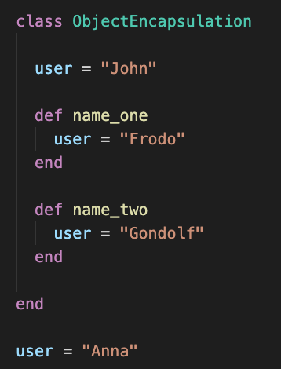

# Week 1 Goals 

- Test-driven a simple program using objects and methods
- Pair using the driver-navigator style
- Follow an effective debugging process
- Describe some basic OO principles like encapsulation, SRP


## Daily Goals 
### Wednesday 15 of April 2020

## Morning Goals 

*Be able to explain what is **encapsulation**, why and where it is used.*

**Plan:**
- Perform research on-line individually. 
- Discuss research findings in group.  
- Describe what is **encapsulation** and its usage. 
- Give some practical example for encapsulation.

**What we learned:**   
> - Encapsulation process is an important part of programming and it can be defined as wrapping up data under a single unit.   
- To **"encapsulate"** means to enclose variables, functions or methods into a small group or object.  
- **Encapsulation** in OOP is commonly done by *“wrapping”* up objects into classes by changing the scope of these objects (or/and simply hiding the data by preventing "data pollution").

><p align="center">
      
    *Object Encapsulation* 
</p>

>**Encapsulation** can be illustrated as per the example above, where we have defined class object named *"ObjectEncapsulation"* and a variable defined below it. In all cases, the same variable name has been used (as well as the same variable "user" in class been defined three times).  
By defining a new instance of the class *"ObjectEncapsulation"* and calling methods defined in the class, as per above, we getting different output every time despite the same variable name.

>```
p user 
user = ObjectEncapsulation.new
p user.name_one
p user.name_two 

>```

## Afternoon Challenges  
Practice pairing and Test-Driven development.

**Plan:** 
Pair with Jed and start working through the afternoon challenge for the week - "Boris Bikes".

**Process:**

- Setting up the project to collaborate on via *GitHub*.  
- Work on transforming **User Story** into a **Domain Model**.
- Write **Feature Test** for a all **Domain models**.
- Using **Stack Trace** identifying an error and using *RSpec* writing a **Unit Test** based of the **Feature Test** observations. 
- Writing a **Unit Test** by defining *RSpec* as testing framework. 
- Pass the **Unit Test** by defining class (require .rb file in a spec file). 
- Back to the **Feature Test**. Testing first method in **Domain Model** defined earlier.
- Back to the **Unit Test**. Writing a test for the instance of the class *"DockingStation"*, expecting *"it"* to respond to the method *"release_bike"*. See it fail before adding a method to the class. 
- Creating new RSpec file and expecting the instance of the class "Bike" to respond to method *"working?"*.
- Back to **Feature Test**. In *REPL* environment upon new instance of the class *"DockingStation"*, calling a method *release_bike* that relies on class *"Bikes"* method *working?*, expecting it to fail as method *release_bike* not returning instance of the class *"Bike"*. 

**What I've Learned:**

> **User Stories:** describe each thing the program is expected to do from the perspective of an user.  

> **Domain Models:** visually illustrates how objects within a system use messages to communicate with one another.  

> **Feature Test:** taking the information from the *Domain Model*. While performing *Feature Test* you need to figure out how Objects and Messages will interact together in the code (Process: test it in IRB).  

> **Unit Test:** performing/defining tests in spec.rb files while running **RSpec**. This drives to write code/method based on test outcome in order to pass it.

> **Stack Trace:** all the lines that get printed when an error is thrown. Gives information about the type of error and all the paths to the different places of the code where it has happened.

## Daily Goals 
### Thursday 16 of April 2020

## Morning Goals 

Learn Debugging Techniques

**Plan:** Attend Debugging workshop and work through the challenges.

**Process:** Debug a program by finding and fixing three bugs. 

- First error been reasonably simple typo in the file (tit**1**e instead of title)
- The second was again a typo, calling a wrong method name (.include**s**? instead of .include?)
- The third one threw a NameError message (undefined variable) and it was coming from one of the project gems (as one of the methods was returning nil).

**What I've learned:**

> Mantra for Debugging:

> - Tighten the loop (find the exact line the bug is coming from).  
- Get visibility (use p to inspect everything to help you home in on the exact line)
- Once you know the one thing that is wrong, try to fix it.

*(Hint: Follow the path of the error as it wont always be directly caused/thrown in the main file or line mentioned by the RSpec...)*

## Afternoon Challenges  
Practice pairing and Test-Driven development.

**Plan:** 
Pair with Ellis and start carried on through the afternoon challenge for the week - "Boris Bikes".

**Process:**

- Add ability to *dock bikes* at the station by adding *dock* method to *DockingStation* class. Pass **Unit Test**.
- Raise an error if docking station is empty in **Unit Test**. Write **Unit Test based on Feature Test**. 
- Raise an exception when docking station is full. Write **RSpec** test that expects to throw an errors. Using **fail** syntax to raise an error if @bikes stores more then 20 bikes.
- Add ability to dock 20 bikes at the station. Writing **Feature Test** for *DockingStation* class *dock* method to test it. Use array to store more than one bike at the docking station. Utilize initialize method. Update release_bike and dock methods as well as **Unit Test** to account for new capacity of 20 bikes.

**What I've Learned:**

>-  Learned that methods can return other objects.
- In **spec.rb** we can have nested `describe` blocks. By nesting it in another `describe` block, we are able to DRY out our description.  

```
require 'docking_station'

describe DockingStation do
  # other tests omitted for brevity

  describe '#release_bike' do
    it 'raises an error when there are no bikes available' do
      # Let's not dock a bike first:
      # remember subject == DockingStation.new
      expect { subject.release_bike }.to raise_error 'No bikes available'
    end
  end
end

```
>- How to raise an error in ruby **RSpec**
```
expect { raise StandardError }.to raise_error
```