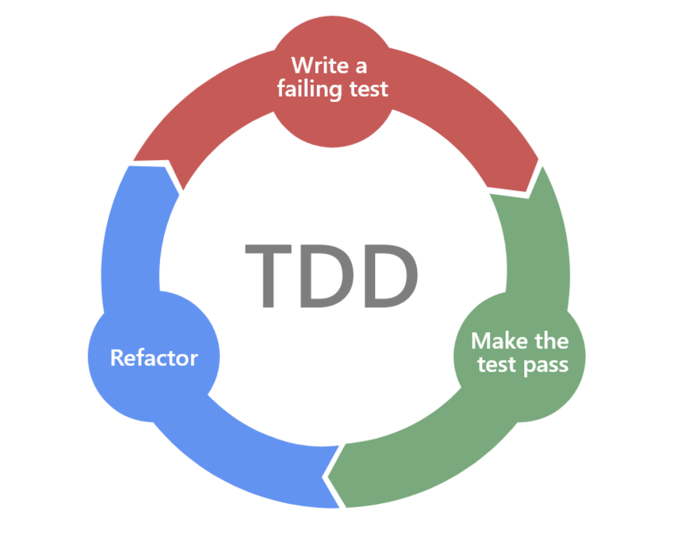
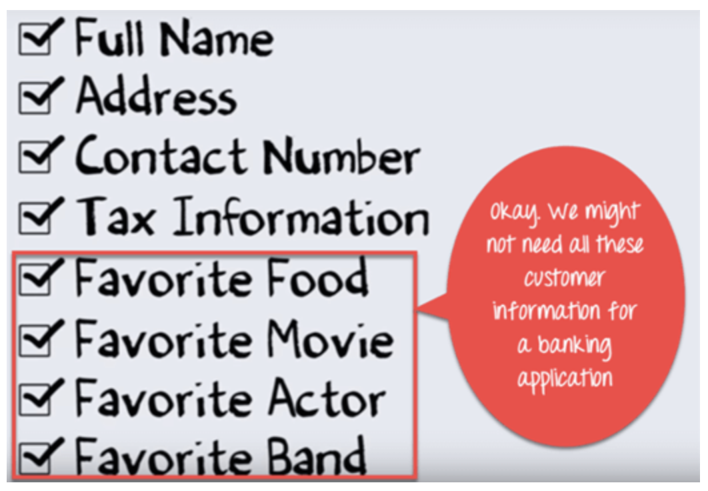
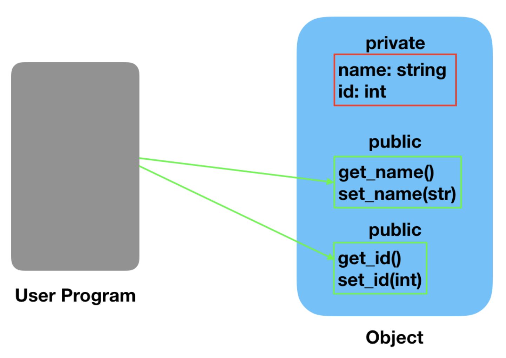
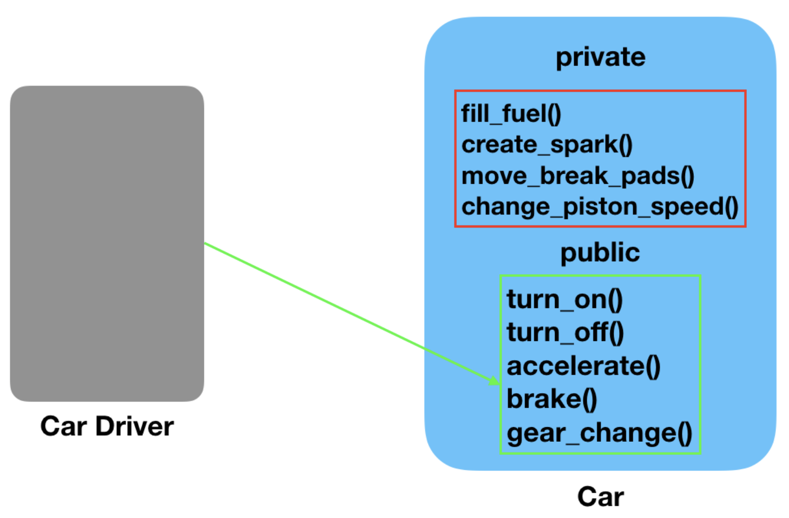

# Week 2 Goals 

- Use all of week 1's skills (don't underestimate the importance of this)
- Break one class into two classes that work together, while maintaining test coverage
- Unit test classes in isolation using mocking
- Explain some basic OO principles and tie them to high level concerns (e.g. ease of     change)
- Review another person's code and give them meaningful feedback

## Daily Goals 
### Monday 20 of April 2020

## Morning Goals 

Code Review for the weekend [**Airport Challenge:**](https://github.com/EdAncerys/airport_challenge)

**Plan:** Peer code review of the weekend challenge. Will be reviewing and getting a feedback to Jed's code.

**Process:**  
- Attend todays *"Intro to code review"* workshop. 
- Start with making an appreciation about Jed’s code.
- Write at least one piece of constructive feedback.
- Spend time implementing those changes.

**What I've learned:**  

> **Test doubles** allow you to define object’s that “stand's” for a real object in your system and will give and "received" data in a predefined patterns as if they were an actual object. To **create a double** use:
```rb
plane = double() # create a double with an optional name
plane = double("new plane")
```

## Afternoon Challenges  

*Practice pairing and Test-Driven development.*  
**"Oystercard Challenge"**

**Plan:** Pair with Jed and keep working on the afternoon challenge for the week - *"Oystercard Challenge".*

**Process:**

- Create a Gemfile (source for gems, version of ruby and add the **RSpec** gem to "test" and "development" groups).
- Create **RSpec** conventional files
- Review debugging basics (understand how to read a stack trace).
- Enable Oystercard card to have a #balance (and equal to 0) on the very first step. 
- Add ability to add money to the *Oystercard* balance on a #top_up.
```rb
  it '#top_up should be able to add to the balance' do
    expect(subject.balance).to eq Oystercard::MINIMUM_VALUE
  end
```  

- Enable #top_up functionality to the *card*.
- Enforce *maximum* balance to the *Oystercard*.
- Ability to #deduct money from current *@balance*.
```rb
  def deduct(value)
    @balance -= value
  end
```
- Add touch in/out support for *Oystercard*.
```rb
  it 'should change @in_journey to false when #touch_out' do
    subject.touch_in "station"
    expect(subject.touch_out).to eq false
  end
```
- Functionality to checking *minimum* balance on touch in for the card.
- When journey is complete, add ability the correct amount deducted from card.
```rb
  def touch_out
    deduct(MINIMUM_VALUE)
    @in_journey = false
  end
```

**What I've Learned:**

> **Gemfile:** a file we create which is used for describing gem dependencies for Ruby programs. A gem is a collection of Ruby code that we can extract into a “collection” which we can call later. Gemfile should always be in the root of your project directory, this is where Bundler expects it to be.

```rb
source "https://rubygems.org"
git_source(:github) {|repo_name| "https://github.com/#{repo_name}" }
ruby '2.7.0'
group :development, :test do
gem "rspec"
```

## Daily Goals 
### Tuesday 21 of April 2020

## Morning Goals 

Unit test classes in isolation using mocking

**Plan:**

- Perform research on-line individually.  
- Describe what is **Mocking and doubles** and its usage. 
- Summarize and give some practical example for **doubles**. 
  
**Process:**  

In automated testing it is common to use objects that look and behave like their production equivalents. This reduces complexity, allows to verify code independently from the rest of the classes and sometimes it is even necessary to execute self validating tests at all. A Test Double is a generic term used for these objects.

It will be times where we need to return fixed/expected value, specially if output might vary or deliberately be random. In **RSpec** we need to have predicted outcome every time no matter what is the input. There is two ways we can approach and control other methods to returned value. 

One way is by using **stubs**, that returns fixed value of the method **without testing behavior** of the method:
```rb
plane = double()
allow(plane).to receive(:stormy?).and return(true)
or
allow(plane).to receive(:stormy?) { true }
```

Another way is to perform **mock's**. And why **Mock**? 

- Represent objects that don’t exist yet, allowing you to focus on what you are currently implementing instead of stopping and creating that object.
- Prevent your test from depending on another object’s implementation and having to set up complex dependencies and data just to write a test. Mocking (*and stubbing*) allow you to truly test in isolation.

**Creating Test double:**

A test double is an object that stands in for another object in your system during a code
example. Use the double method, passing in an optional identifier, to create one:
```rb
plane = double("plane")
```
Important fact to remember that by mocking we **Do test method functionality** by passing/expected to receive, predefined input.
And now implementing mocking in **RSpec** can be written as per bellow:

```rb
expect(subject).to receive(:stormy?).with("stormy")
```

**What I've learned:** 

>**Mocks**  

>Mocking gives you the ability to focus in on what you are testing while removing dependencies in your test on how collaborator objects are implemented. However, the dangers of ‘faking it’ means you need to mock responsibly.

>**Test doubles** allow you to define object’s that “stand in” for a real object in your system and will give and receive data in a predefined patterns as if they were an actual object.

## Afternoon Challenges  

*Practice pairing and Test-Driven development.*  
**"Oystercard Challenge"**

**Plan:** Pair with Colin and keep working on the afternoon challenge for the week - *"Oystercard Challenge".*

**Process:**

- Save the Entry station (upon #touch_in store station argument to instance variable. Set that variable back to nil upon touch_out)
- Refactor to remove the in_journey variable. Rewrite the in_journey? method to infer its status based on whether or not there is an entry station
```rb
  def in_journey?
    !!@entry_station  # converts @entry_station in a boolean (will return true for any value thats not nil/false)
  end
```
- Expose entry_station instance variable using an attribute reader.
- Create a Journey History (at #touch_out push a hash with @entry_station and @exit_station into the @journey_history array)
```rb
@journey_history << {:entry_station => @entry_station, :exit_station => @exit_station}
```
- Create a station class that initializes with name and zone.

**What I've Learned:**

>**Double Bang:** When using the not-operator(!) we turn the data it’s operating on into a Boolean before negating it. A truthy value would become the Boolean false and a falsey value would become the Boolean true. <br/>
When we add the second bang (!!) it flips the resultant Boolean back to the appropriate value: it will make a truthy value into the Boolean true and a falsey to false.
```rb
"hello"   #-> this is a string; it is not in a boolean context
!"hello"  #-> this is a string that is forced into a boolean 
          #   context (true), and then negated (false)
!!"hello" #-> this is a string that is forced into a boolean 
          #   context (true), and then negated (false), and then 
          #   negated again (true)
```

## Daily Goals 
### Wednesday 22 of April 2020

## Morning Goals 

Unit test and Feature test usage and deferences. 

**Plan:**

- Perform research on-line individually.  
- Describe what **Unit and Feature Tests are** and their usages. 
- Summarize and give some practical example. 
  
**Process:** 

**Unit tests** are automated tests written and run by software developers to ensure that a section of an application (known as the "unit") meets its design and behaves as intended. In *object-oriented programming*, a unit is often an entire interface, such as a class, but could be an individual method. By writing tests first for the smallest testable units, then the compound behaviors between those, one can build up comprehensive tests for complex applications.

<p align="center">
      
    *TDD* 
</p>

**Feature Testing** normally a tester isn’t concerned with the actual code, rather then to verify the output based on given the user requirements with the expected output.   

The prime objective of **Feature testing** is to check the functionalities of the system. **Feature tests** check the entire application, its hardware, and networking infrastructure, from the front end UI to the back-end database systems. In that sense, feature tests are also a form of integration testing, ensuring that different components are working together as expected.

Unlike **unit tests**, the **feature tests** don’t tell you what is broken or where to locate the failure in the code base. They just tell you something is broken and not performs/could't be tested as expected. **Feature tests**, by definition, testing end-to-end user functionality that normally end user sees/performs at UI.

<p align="center">
      
    *Feature Test illustration* 
</p>

**When to perform?** Unit tests aren’t a replacement for functional testing. But they are the solid foundation on which the rest of your testing process should be built. 

The best practice is that you should start writing your tests when you start writing your code. Test Driven Development (TDD) is a popular software development practice which advocates writing tests before the code.  

*Unlike unit tests, the functional tests don’t tell you what is broken or where to locate the failure in the code base. They just tell you something is broken.*

**What I've learned:** 

> The ultimate goal of software testing is to build a quality product. In testing, **Unit testing and Feature testing** considered as a foundation of the testing process. However, *unit testing* is performed by Developers whereas *feature testing* is performed by Testers (similar to UI).  
*According to Ward Cunningham, “Functional test and Unit test serve different purposes. One gives the developer confidence when refactoring, the other gives the customer confidence when planning.”*

## Afternoon Challenges  

*Practice pairing and Test-Driven development.*  
**"Oystercard Challenge"**

**Plan:** Pair with Lizzie and keep working on the afternoon challenge for the week - *"Oystercard Challenge".*

**Process:**

- Spent some time to re-factor code in Lizzie's project to bring it up in better shape. 
- Reviewed and compared code and discussed similarities and differences.
- Extracted method #deduct as a private method.
```rb
  private 
  def deduct(value)
    @balance -= value
  end
```
- Added ability to have @journey_history empty upon start of the journey.
- Tested to have ability to have @journey_history after #touch_out.
```rb
  it 'shout have journey_history after a travel' do
    subject.touch_in station
    subject.touch_out station
    expect(subject.journey_history.empty?).to eq false
  end
```

**What I've Learned:**

> Privates methods can't be tested with **RSpec** directly. Walk around to test private method is by testing method that is dependent on private method and writing a test for it. It also can be done by mocking it:
```rb
expect { subject.touch_out(:deduct, Oystercard::MINIMUM_VALUE) }.to change{ subject.balance }.by -Oystercard::MINIMUM_VALUE
```

## Skills workshop

**Plan:** *Attend Skill workshop and practice TDD skills in pairs.*

*Been paired up with Dec to work on skills workshop challenges*

**Process:**

- Watch our pair partner test drive "kata" challenge and provide constructive feedback. 
- Kata that I test drive been *"Get the Middle Letter(s)"* challenge.
- My main goal was to take *step by step approach* to solve this challenge by braking it down in to smaller pieces.
- Even I did have a plan but took completely different approach to it as jumped straight in to thinking about the outcome and the result without taking methodical and thought-full approach to the challenge.
- In fact spent nearly all the time jumping from one solution to the other and waist most of the time not even taking right approach.
- Close to preset challenge time I started to make a progress as get a grip of what's needed to be done and what approach I should take.

**What I've learned:** 

> Take methodical approach to the problem. **NEVER** start solving the problem without having a plan and/or good understanding of what approach/way I should take and what requirements are in the first place! 

> Did have first practical example where I needed to expect/get different outputs in **RSpec** test. Learned that matchers can be chained to expect multiple outcomes:

```rb
it "fails when the second matcher fails" do
    expect(string).to start_with("foo").and end_with("bar")
  end
```

## Daily Goals 
### Thursday 23 of April 2020

## Morning Goals 

*Object-orientated principles (OOP)* - **Abstraction**. 

**Plan:**

- Perform research on-line individually.  
- Describe what **Abstraction in OO is** and it's usages. 
- Summarize and give some practical example. 
  
**Process:** 

**Abstraction** is on of the four key concepts concepts of **OOP** (Object Oriented Programming). They are *Inheritance, Abstraction, Polymorphism and Encapsulation*.

What is Abstraction in OOP? **Abstraction** is selecting data from a larger pool to show only the relevant details of the object to the user. Abstraction “shows” only the essential attributes and “hides” unnecessary information. It helps to reduce programming complexity and effort.

Let’s illustrate **Abstraction** concept with an Example. Suppose you want to create a banking application and you are asked to collect all the information about your customer. There are chances that you will come up with following information about the customer:

<p align="center">
      
    *Abstraction in OOP* 
</p>

But, not all of the above information is required to create a banking application. So, you need to select only the useful information for your banking application from that pool. Data like name, address, tax information, etc. make sense for a banking application.

Since we have fetched/removed/selected the customer information from a larger pool, the process is referred as Abstraction.

There are also the different levels of Abstraction and it's good practice that classes/methods should interact with other classes/methods with the same level of abstraction or higher level of abstraction. As you increase the level of Abstraction, things start getting simpler and simpler because you leave out details.

When the object data is not visible to the outer world, it creates data abstraction.

<p align="center">
      
    *Data Abstraction in OOP* 
</p>

We don’t need to provide details about all the methods of an object. When we hide the internal implementation of the different functions involved in a user operation, it creates process abstraction.

Abstraction hides complexity by giving you a more abstract picture, a sort of 10,000 feet view, while Encapsulation hides internal working so that you can change it later. In other words, Abstraction hides details at the design level, while Encapsulation hides details at the implementation level.

For example, when you first describe an object, you talk in more abstract term e.g. a Vehicle which can move, you don't tell how Vehicle will move, whether it will move by using tires or it will fly or it will sell. It just moves. This is called Abstraction. We are talking about a most essential thing, which is moving, rather than focusing on details like moving in plane, sky, or water.

<p align="center">
      
    *Proses Abstraction in OOP* 
</p>

**What I've learned:** 

> **Abstraction** is about hiding unwanted details while giving out most essential details.

> **Abstraction** lets you focus on what the object does instead of how it does.

> **Abstraction** is displaying only essential information and hiding the details. Data abstraction refers to providing only essential information about the data to the outside world, hiding the background details or implementation.

## Daily Goals 
### Friday 24 of April 2020

## Morning Goals 

*Object-orientated principles (OOP)* - **Polymorphism**. 

**Plan:**

- Perform research on-line individually.  
- Describe what **Polymorphism in OO is** and it's usages. 
- Summarize and give some practical example. 
  
**Process:** 

Polymorphism is a made up of two words Poly which means Many and Morph which means Forms. So Polymorphism is a method where one is able to execute the same method using different objects. In polymorphism, we can obtain different results using the same method by passing different input objects. 

Generally, **Polymorphism** is the ability to appear in many forms. In object-oriented programming, polymorphism refers to a programming language's ability to process objects differently depending on their data type or class. More specifically, it is the ability to redefine methods for derived classes. For example, given a base class shape, polymorphism enables the programmer to define different area methods for any number of derived classes, such as circles, rectangles and triangles. No matter what shape an object is, applying the area method to it will return the correct results. Polymorphism is considered to be a requirement of any true object-oriented programming language (OOPL).

In Polymorphism, classes have different functionality but they share common interference. The concept of polymorphism can be studied under few sub categories.

- Polymorphism using Inheritance
- Polymorphism using Duck-Typing

**Polymorphism using inheritance** Inheritance is a property where a child class inherits the properties and methods of a parent class. One can easily implement polymorphism using inheritance. It can be explained using the following *example:*

```rb
    # Ruby program of Polymorphism using inheritance 
    class Vehicle 
      def tyreType 
        puts "Heavy Car"
      end
    end
   
    # Using inheritance  
    class Car < Vehicle 
      def tyreType 
        puts "Small Car"
      end
    end
   
    # Using inheritance  
    class Truck < Vehicle 
      def tyreType 
        puts "Big Car"
      end
    end

# Creating object  
vehicle = Vehicle.new
vehicle.tyreType() # Outputs "Heavy car"
   
# Creating different object calling same function  
vehicle = Car.new
vehicle.tyreType() # Outputs "Small car" 
   
# Creating different object calling same function  
vehicle = Truck.new
vehicle.tyreType() # Outputs "Big car" 
```

**Polymorphism using Duck-Typing** In Ruby, we focus on the object’s capabilities and features rather than its class. So, Duck Typing is nothing but working on the idea of what an object can do rather than what it actually is. Or, what operations could be performed on the object rather than the class of the object.
Here is a small program to represent the before mentioned process.
*Example:*

```rb
# Ruby program of polymorphism using Duck typing 
# Creating three different classes 
class Hotel 
   
  def enters 
    puts "A customer enters"
  end
   
  def type(customer) 
    customer.type 
  end
   
  def room(customer) 
    customer.room 
  end
   
end
   
# Creating class with two methods  
class Single 
   
  def type 
    puts "Room is on the fourth floor."
  end
   
  def room 
    puts "Per night stay is 50£"
  end
   
end
   
   
class Couple 
   
 # Same methods as in class single 
  def type 
    puts "Room is on the second floor"
  end
   
  def room 
    puts "Per night stay is 80£"
  end
   
end
   
# Creating Object 
# Performing polymorphism  
hotel= Hotel.new
puts "This visitor is Single."
customer = Single.new
hotel.type(customer) # Outputs "Room is on the fourth floor"
hotel.room(customer) # Outputs "Per night stay is 50£"
   
   
puts "The visitors are a couple."
customer = Couple.new
hotel.type(customer) # Outputs "Room is on the second floor"
hotel.room(customer) # Outputs "Per night stay is 80£"
```

**What I've learned:** 

> In OOP **Polymorphism** is an ability to created a variable, method or an object that have more than one form.
