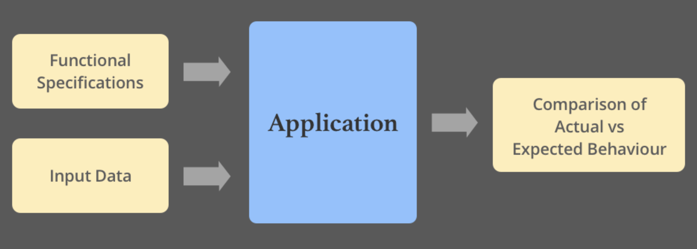

# Week 2 Goals 

- Use all of week 1's skills (don't underestimate the importance of this)
- Break one class into two classes that work together, while maintaining test coverage
- Unit test classes in isolation using mocking
- Explain some basic OO principles and tie them to high level concerns (e.g. ease of     change)
- Review another person's code and give them meaningful feedback

## Daily Goals 
### Monday 20 of April 2020

## Morning Goals 

Code Review for the weekend [**Airport Challenge:**](https://github.com/EdAncerys/airport_challenge)

**Plan:** Peer code review of the weekend challenge. Will be reviewing and getting a feedback to Jed's code.

**Process:**  
- Attend todays *"Intro to code review"* workshop. 
- Start with making an appreciation about Jed’s code.
- Write at least one piece of constructive feedback.
- Spend time implementing those changes.

**What I've learned:**  

> **Test doubles** allow you to define object’s that “stand's” for a real object in your system and will give and "received" data in a predefined patterns as if they were an actual object. To **create a double** use:
```rb
plane = double() # create a double with an optional name
plane = double("new plane")
```

## Afternoon Challenges  

*Practice pairing and Test-Driven development.*  
**"Oystercard Challenge"**

**Plan:** Pair with Jed and keep working on the afternoon challenge for the week - *"Oystercard Challenge".*

**Process:**

- Create a Gemfile (source for gems, version of ruby and add the **RSpec** gem to "test" and "development" groups).
- Create **RSpec** conventional files
- Review debugging basics (understand how to read a stack trace).
- Enable Oystercard card to have a #balance (and equal to 0) on the very first step. 
- Add ability to add money to the *Oystercard* balance on a #top_up.
```rb
  it '#top_up should be able to add to the balance' do
    expect(subject.balance).to eq Oystercard::MINIMUM_VALUE
  end
```  

- Enable #top_up functionality to the *card*.
- Enforce *maximum* balance to the *Oystercard*.
- Ability to #deduct money from current *@balance*.
```rb
  def deduct(value)
    @balance -= value
  end
```
- Add touch in/out support for *Oystercard*.
```rb
  it 'should change @in_journey to false when #touch_out' do
    subject.touch_in "station"
    expect(subject.touch_out).to eq false
  end
```
- Functionality to checking *minimum* balance on touch in for the card.
- When journey is complete, add ability the correct amount deducted from card.
```rb
  def touch_out
    deduct(MINIMUM_VALUE)
    @in_journey = false
  end
```

**What I've Learned:**

> **Gemfile:** a file we create which is used for describing gem dependencies for Ruby programs. A gem is a collection of Ruby code that we can extract into a “collection” which we can call later. Gemfile should always be in the root of your project directory, this is where Bundler expects it to be.

```rb
source "https://rubygems.org"
git_source(:github) {|repo_name| "https://github.com/#{repo_name}" }
ruby '2.7.0'
group :development, :test do
gem "rspec"
```

## Daily Goals 
### Tuesday 21 of April 2020

## Morning Goals 

Unit test classes in isolation using mocking

**Plan:**

- Perform research on-line individually.  
- Describe what is **Mocking and doubles** and its usage. 
- Summarize and give some practical example for **doubles**. 
  
**Process:**  

In automated testing it is common to use objects that look and behave like their production equivalents. This reduces complexity, allows to verify code independently from the rest of the classes and sometimes it is even necessary to execute self validating tests at all. A Test Double is a generic term used for these objects.

It will be times where we need to return fixed/expected value, specially if output might vary or deliberately be random. In **RSpec** we need to have predicted outcome every time no matter what is the input. There is two ways we can approach and control other methods to returned value. 

One way is by using **stubs**, that returns fixed value of the method **without testing behavior** of the method:
```rb
plane = double()
allow(plane).to receive(:stormy?).and return(true)
or
allow(plane).to receive(:stormy?) { true }
```

Another way is to perform **mock's**. And why **Mock**? 

- Represent objects that don’t exist yet, allowing you to focus on what you are currently implementing instead of stopping and creating that object.
- Prevent your test from depending on another object’s implementation and having to set up complex dependencies and data just to write a test. Mocking (*and stubbing*) allow you to truly test in isolation.

**Creating Test double:**

A test double is an object that stands in for another object in your system during a code
example. Use the double method, passing in an optional identifier, to create one:
```rb
plane = double("plane")
```
Important fact to remember that by mocking we **Do test method functionality** by passing/expected to receive, predefined input.
And now implementing mocking in **RSpec** can be written as per bellow:

```rb
expect(subject).to receive(:stormy?).with("stormy")
```

**What I've learned:** 

>**Mocks**  

>Mocking gives you the ability to focus in on what you are testing while removing dependencies in your test on how collaborator objects are implemented. However, the dangers of ‘faking it’ means you need to mock responsibly.

>**Test** doubles allow you to define object’s that “stand in” for a real object in your system and will give and receive data in a predefined patterns as if they were an actual object.

## Afternoon Challenges  

*Practice pairing and Test-Driven development.*  
**"Oystercard Challenge"**

**Plan:** Pair with Colin and keep working on the afternoon challenge for the week - *"Oystercard Challenge".*

**Process:**

- Save the Entry station (upon #touch_in store station argument to instance variable. Set that variable back to nil upon touch_out)
- Refactor to remove the in_journey variable. Rewrite the in_journey? method to infer its status based on whether or not there is an entry station
```rb
  def in_journey?
    !!@entry_station  # converts @entry_station in a boolean (will return true for any value thats not nil/false)
  end
```
- Expose entry_station instance variable using an attribute reader.
- Create a Journey History (at #touch_out push a hash with @entry_station and @exit_station into the @journey_history array)
```rb
@journey_history << {:entry_station => @entry_station, :exit_station => @exit_station}
```
- Create a station class that initializes with name and zone.

**What I've Learned:**

>**Double Bang:** When using the not-operator(!) we turn the data it’s operating on into a Boolean before negating it. A truthy value would become the Boolean false and a falsey value would become the Boolean true. <br/>
When we add the second bang (!!) it flips the resultant Boolean back to the appropriate value: it will make a truthy value into the Boolean true and a falsey to false.
```rb
"hello"   #-> this is a string; it is not in a boolean context
!"hello"  #-> this is a string that is forced into a boolean 
          #   context (true), and then negated (false)
!!"hello" #-> this is a string that is forced into a boolean 
          #   context (true), and then negated (false), and then 
          #   negated again (true)
```

## Daily Goals 
### Wednesday 22 of April 2020

## Morning Goals 

Unit test and Feature test usage and deferences. 

**Plan:**

- Perform research on-line individually.  
- Describe what **Unit and Feature Tests are** and their usages. 
- Summarize and give some practical example. 
  
**Process:** 

**Unit tests** are automated tests written and run by software developers to ensure that a section of an application (known as the "unit") meets its design and behaves as intended. In *object-oriented programming*, a unit is often an entire interface, such as a class, but could be an individual method. By writing tests first for the smallest testable units, then the compound behaviors between those, one can build up comprehensive tests for complex applications.

<p align="center">
      
    *TDD* 
</p>

**Feature Testing** normally a tester isn’t concerned with the actual code, rather then to verify the output based on given the user requirements with the expected output.   

The prime objective of **Feature testing** is to check the functionalities of the system. **Feature tests** check the entire application, its hardware, and networking infrastructure, from the front end UI to the back-end database systems. In that sense, feature tests are also a form of integration testing, ensuring that different components are working together as expected.

Unlike **unit tests**, the **feature tests** don’t tell you what is broken or where to locate the failure in the code base. They just tell you something is broken and not performs/could't be tested as expected. **Feature tests**, by definition, testing end-to-end user functionality that normally end user sees/performs at UI.

<p align="center">
      
    *Feature Test illustration* 
</p>

**When to perform?** Unit tests aren’t a replacement for functional testing. But they are the solid foundation on which the rest of your testing process should be built. 

The best practice is that you should start writing your tests when you start writing your code. Test Driven Development (TDD) is a popular software development practice which advocates writing tests before the code.  

*Unlike unit tests, the functional tests don’t tell you what is broken or where to locate the failure in the code base. They just tell you something is broken.*

**What I've learned:** 

> The ultimate goal of software testing is to build a quality product. In testing, **Unit testing and Feature testing** considered as a foundation of the testing process. However, *unit testing* is performed by Developers whereas *feature testing* is performed by Testers.  
*According to Ward Cunningham, “Functional test and Unit test serve different purposes. One gives the developer confidence when refactoring, the other gives the customer confidence when planning.”*
