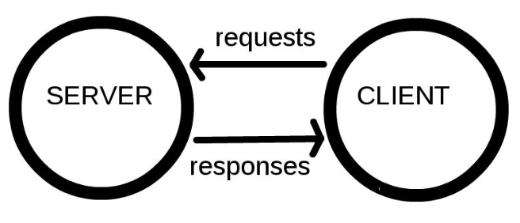
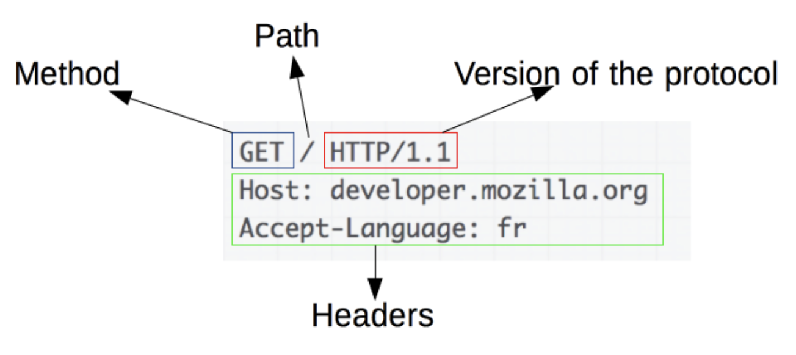
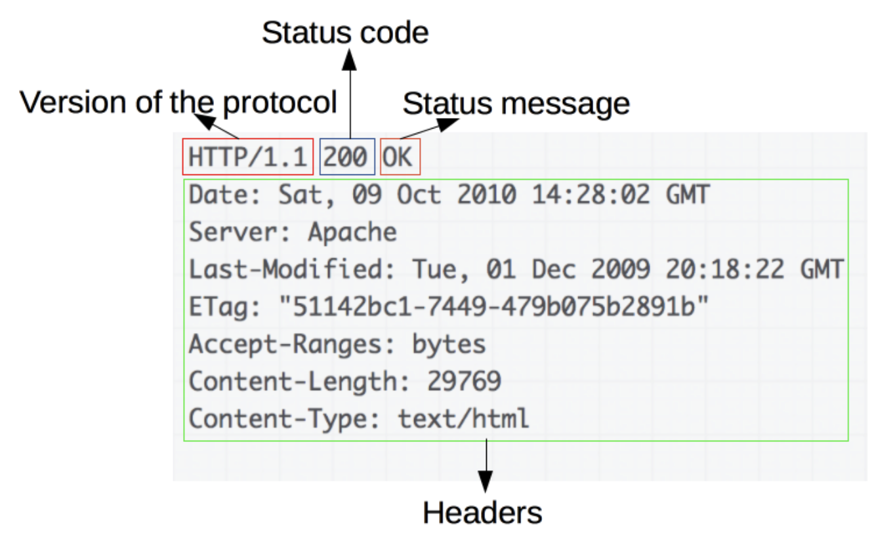
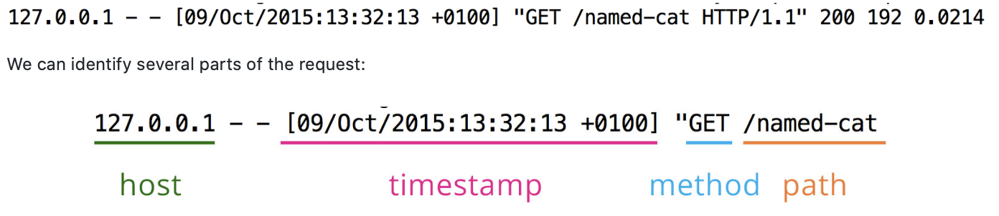
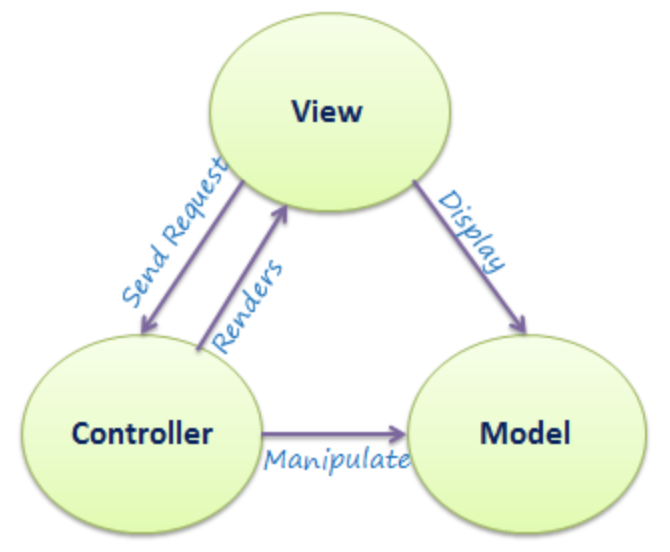
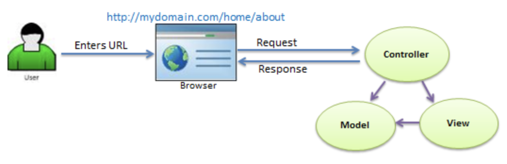

# Week 3 Goals 

#### By the end of the week all developers can:

- Build a simple web app.
- Follow an effective debugging process for web applications.
- Explain the basics of how the web works (e.g. request/response, HTTP, HTML, CSS).
- Explain the MVC pattern.

## Daily Goals 
### Monday 27 of April 2020

## Morning Goals 

Set a working plan for the new week

##### Plan:

- Review weekend challenge in pair
- Set goals for the new week
- Attend *Week 3* kick of class.

**Process:** 

Analise and go through the main Web concepts and skills: 

- The relationship between a client and a server.
- How HTTP is used to send information over the web.
- RESTful APIs.
- The request/response cycle.
- Web templating with HTML/CSS.

## Morning Goals 

The relationship between a client and a server. How HTTP is used to send information over the web.

**Plan:**

- Perform research online individually.  
- Describe what **server-client** relationship is and how **HTTP** is used. 
- Summarize and give some practical example. 
  
**Process:** 

The *World Wide Web* is an information space made up of two chief components: resources (mostly stored on servers), and the entities that request those resources (usually called clients).

The whole **Web** is built on **client-server** relationships. There are different kinds of **clients** and **servers** but the relationship is roughly the same: the client is dependent on the server for providing and managing information. Anything that can request a resource from a server can be called a client.

<p align="center">
      
    *Client-Server relationship* 
</p>

**HTTP** or *Hypertext Transfer Protocol* is a protocol which allows the fetching of resources, such as HTML documents. It is the foundation of any data exchange on the Web and it is a client-server protocol, which means requests are initiated by the recipient, usually the Web browser. A complete document is reconstructed from the different sub-documents fetched, for instance text, layout description, images, videos, scripts, and more.

#### Components of HTTP-based systems

**Client: the user-agent**

The user-agent is any tool that acts on the behalf of the user. This role is primarily performed by the Web browser; other possibilities are programs used by engineers and Web developers to debug their applications.

The browser is **always** the entity initiating the request. It is never the server (though some mechanisms have been added over the years to simulate server-initiated messages).

<p align="center">
      
    *Client-Server relationship* 
</p>

**The Web server**

On the opposite side of the communication channel, is the server, which serves the document as requested by the client. A server appears as only a single machine virtually: this is because it may actually be a collection of servers, sharing the load (load balancing) or a complex piece of software interrogating other computers (like cache, a DB server, or e-commerce servers), totally or partially generating the document on demand.

<p align="center">
      
    *Client-Server relationship* 
</p>

**Proxies**

Between the Web browser and the server, numerous computers and machines relay the HTTP messages. Due to the layered structure of the Web stack, most of these operate at the transport, network or physical levels, becoming transparent at the HTTP layer and potentially making a significant impact on performance. Those operating at the application layers are generally called proxies. 

**What I've learned:** 

> The whole Web is built on client-server relationships. 

> **HTTP** is an extensible protocol that is easy to use. The client-server structure, combined with the ability to simply add headers, allows HTTP to advance along with the extended capabilities of the Web.

## Afternoon Challenges  

*Practice pairing and building Web-app.*  
**"Battle Challenge"**

**Plan:** Pair with Hibo and keep working on the afternoon challenge for the week - *"Battle".*

**Process:**

- Reflect on documentation and get familiar with following: *The Web, HTTP, HTTP parameters, HTTP verbs.*
- Sinatra: Getting started. As basic web framework, Sinatra, that can receive and respond to HTTP requests. Set up and run Sinatra from within your own computer.
- Sinatra: Defining a route
```rb
require 'sinatra'
get '/' do
  'hello!'
end
```
- Sinatra: Start and restart server to render different information.
- Sinatra: Returning HTML. Placing a **"string"** in a block to render view.
```rb
get '/home' do
  "<h1>Hello World</h1>"
end
```
- Sinatra: Views. Can render partial by passing to the block `erb(:index)`
- Sinatra: ERB. Ruby Expression using `<%= %>` ('ERB tags')
- Sinatra: Keeping views clean. Making sure our file that renders *view* only have elements that related and do not have any logic/functions. **SRP !!!**
- Sinatra: Introducing `params`. Thats information passed in form of **hash** as **key-value** pair to servers `/home path: ?name=James`

**What I've Learned:**

> **Sinatra: Defining a route**. We can handle/define and setup routes by the request path ** /. / **. Browser is making a request using a path for which your server has route setup. When a server receives a request along with a path, it activates a particular route.  
> **Sinatra** gem basic web framework that can receive and respond to HTTP requests.  
> **Sinatra: Views** - sets up view partials that helps to render views for web apps. 

## Daily Goals 
### Tuesday 28 of April 2020

## Morning Goals 

Basics, how the web works: **RESTful APIs**

**Plan:**

- Perform research online individually.  
- Describe what **Abstraction in OO is** and it's usages. 
- Summarize and give some practical example. 
  
**Process:** 

A RESTful API is an application program interface (API) that uses HTTP requests to GET, PUT, POST and DELETE data.

An **API** is an application programming interface. It is a set of rules that allow programs to talk to each other. The developer creates the API on the server and allows the client to talk to it.

**REST** determines how the API looks like. It stands for "Representational State Transfer". It is a set of rules that developers follow when they create their API. One of these rules states that you should be able to get a piece of data (called a resource) when you link to a specific URL.

Each **URL** is called a request while the data sent back to you is called a response.

**Resource**

The key abstraction of information in REST is a resource. Any information that can be named can be a resource: a document or image, a temporal service, a collection of other resources, a non-virtual object (e.g. a person), and so on. REST uses a resource identifier to identify the particular resource involved in an interaction between components.

The state of the resource at any particular timestamps is known as resource representation. A representation consists of data, metadata describing the data and hypermedia links which can help the clients in transition to the next desired state.

**REST and HTTP are not same !!**

A lot of people prefer to compare HTTP with REST. REST and HTTP are not same.
```
REST != HTTP
```

**Uses**

Because the calls are stateless, REST is useful in cloud applications. Stateless components can be freely redeployed if something fails, and they can scale to accommodate load changes. This is because any request can be directed to any instance of a component; there can be nothing saved that has to be remembered by the next transaction. That makes REST preferable for web use, but the RESTful model is also helpful in cloud services because binding to a service through an API is a matter of controlling how the URL is decoded.

**What I've Learned:**

> REST is acronym for **REpresentational** State Transfer.  

> Resources are decoupled from their representation so that their content can be accessed in a variety of formats, such as HTML, XML, plain text, PDF, JPEG, JSON, and others. Metadata about the resource is available and used, for example, to control caching, detect transmission errors, negotiate the appropriate representation format, and perform authentication or access control. And most importantly, every interaction with a resource is stateless.  

> All these principles help RESTful applications to be simple, lightweight, and fast.

## Afternoon Challenges  

*Practice pairing and building Web-app.*  
**"Battle Challenge"**

**Plan:** Pair with Tanil and keep working on the afternoon challenge for the week - *"Battle".*

**Process:**

- Recap on progress and even out any differences.
- Sinatra: Using forms. Instead of letting user to interact  via URL bar we can allow our users to interact with our app via a `<form>` element. 
```rb
form.erb # View partial 
  <form name="input" action=“/form” method=“post”>
  username: <input type=“text” name=“username”>
  password: <input type=“password” name=“password”>

  <input type=“submit” value=“Submit”>
  </form>
```
- **Sinatra: POSTed** params we able to hide request parameters by using a **POST** request.

<p align="center">
      
    *Data Abstraction in OOP* 
</p>

We able to ask our form to submit its data as a POST request instead:
```
<form action="/named-cat" method="post">
  <input type="text" name="name">
  <input type="submit" value="Submit">
</form>
```
Now when we submit the form, we get Sinatra's 'undefined route' error. That's because we've only defined a route that can handle the request GET /named-cat. We don't have a route that can handle POST /named-cat.

Let's change our /named-cat route to handle POST requests instead of GET ones:

```
# in app.rb
# first, let's write a form-displaying route
get '/cat-form' do
  erb :cat_form
end

post '/named-cat' do
  p params
  @name = params[:name]
  erb :index
end
```

**What I've Learned:**

> **POST** requests do not store their query parameters in the request string. Instead, they store them in the body of the request as 'Form Data'.

> **params** we print to the console have not changed. This is what we expect: although POST sends parameters from clients to servers in a different way to GET, it still sends them. All interpreted the same way by Sinatra.

## Daily Goals 
### Wednesday 29 of April 2020

## Morning Goals 

Web templating with HTML/CSS.

**Plan:**

- Perform research online individually.  
- Describe what **Abstraction in OO is** and it's usages. 
- Summarize and give some practical example. 
  
**Process:** 

**What is HTML?**

**HTML** is the language for describing the structure of Web pages. HTML gives authors the means to:  

- Publish online documents with headings, text, tables, lists, photos, etc.
- Retrieve online information via hypertext links, at the click of a button.
- Design forms for conducting transactions with remote services, for use in searching for   information, making reservations, ordering products, etc.
- Include spread-sheets, video clips, sound clips, and other applications directly in       their documents.

**What is CSS?**

**CSS** is the language for describing the presentation of Web pages, including colors, layout, and fonts. It allows one to adapt the presentation to different types of devices, such as large screens, small screens, or printers. 

CSS is independent of HTML and can be used with any XML-based markup language. The separation of HTML from CSS makes it easier to maintain sites, share style sheets across pages, and tailor pages to different environments. This is referred to as the separation of structure (or: content) from presentation.

**Examples**

**External CSS.** An external style sheet is used to define the style for many HTML pages.

With an external style sheet, you can change the look of an entire web site, by changing one file! To use an external style sheet, add a link to it in the <head> section of the HTML page:

```
<!DOCTYPE html>
<html>
<head>
  <link rel="stylesheet" href="styles.css">
</head>
<body>

<h1>This is a heading</h1>
<p>This is a paragraph.</p>

</body>
</html>
```

The following very simple example of a portion of an HTML document illustrates how to create a link within a paragraph. When rendered on the screen (or by a speech synthesizer), the link text will be “final report”; when somebody activates the link, the browser will retrieve the resource identified by “http://www.example.com/report”:
```
<p class="moreinfo">For more information see the
<a href="http://www.example.com/report">final report</a>.</p>
```

The class attribute on the paragraph's start tag `<p>` can be used, among other thing, to add style. For instance, to italicize the text of all paragraphs with a class of “moreinfo,” one could write, in CSS:

```
p.moreinfo { font-style: italic }
```

By placing that rule in a separate file, the style may be shared by any number of HTML documents.

**What I've Learned:**

> With **HTML** we describe the structure of pages using markup. The elements of     the language label pieces of content such as “paragraph,” “list,” “table,” and so on.

> **Cascading Style Sheets** (CSS) is a stylesheet language used to describe the           presentation of a document written in HTML or XML (including XML dialects such as SVG,   MathML or XHTML). CSS describes how elements should be rendered on screen, on paper, in   speech, or on other media.

## Afternoon Challenges  

*Practice pairing and building Web-app.*  
**"Battle Challenge"**

**Plan:** Pair with Jo and keep working on the afternoon challenge for the week - *"Battle".*

**Process:**

- Recap on progress and talk through the concept.
- Testing with an Automated Browser and Capybara
- Start a new project **Battle** by creating a Gemfile with Sinatra, Capybara   and Rspec.
```
# In Gemfile
source 'https://rubygems.org'
gem 'rspec'
gem 'sinatra'
```
- Creating a controller file app.rb and require sinatra 

```ruby
# in app.rb

require 'sinatra/base'

class Battle < Sinatra::Base
  get '/' do
    'Hello Battle!'
  end

  # start the server if ruby file executed directly
  run! if app_file == $0
end
```
- Create a config.ru file you can use to run your app.

```rb
require_relative './app'
run Battle
```

- Initialize `rspec --init` to start writing your tests.
- Getting test infrastructure set up by adding capybara gem and in spec_helper.rb file the following:

```rb
  ENV['RACK_ENV'] = 'test'

  # require our Sinatra app file
  require File.join(File.dirname(__FILE__), '..', 'app.rb')

  require 'capybara'
  require 'capybara/rspec'
  require 'rspec'

  # tell Capybara about our app class
  Capybara.app = Battle
```

- In spec/features, write a feature test that checks that the hompage says     Testing infrastructure working!.
- Use params to extract information from a request by taking assigned values   from in the form.

```rb
<form action="/names" method="post">
  <input type="text" name="player_1_name">
  <input type="text" name="player_2_name">
  <input type="submit" value="Submit">
</form>
```
- Write a feature test using **Capybara.**
```rb
feature 'Enter names' do
  scenario 'submitting names' do
    visit('/')
    fill_in :player_1_name, with: 'Dave'
    fill_in :player_2_name, with: 'Mittens'
    click_button 'Submit'
    expect(page).to have_content 'Dave vs. Mittens'
  end
end
```


**What I've Learned:**

> **Capybara** is a web-based test automation software that simulates scenarios     for user stories and automates web application testing for behavior-driven   software development. It is written in the Ruby programming language.         Capybara can mimic actions of real users interacting with web-based           applications.

> **What is Browser Automation?** In the most fundamental sense, browser       automation is the act of running various tasks, or instances, to gather       insights into the functionality and performance of site pages, applications   and lines of code.

> **Selenium WebDriver**. Featured snippet from the web WebDriver is a web     automation framework that allows you to execute your tests against           different browsers, not just Firefox, Chrome

## Daily Goals 
### Thursday 30 of April 2020

## Morning Goals 

Improve debugging techniques.

**Plan:** Attend Debugging Web Apps Workshop with Eoin
  
**Process:** 

- See the list of error messages
- Pick one (unit test before feature tests)
- Run rspec with the error path (shows only one error at a time)
- Read the error message
- Go to the file and line that the error is pointing (go to line command   can do this with the path)
- Get overall view of your code and your tests to see it as a whole
- Try to understand what the code does and what is being tested (look for   the syntax that you don’t understand).  
- Try an idea and see if error changes
- Zoom out when you do changes to see if the rest of tests for that code   are still passing (your changes may break them)
- Keep looping through rest of the errors until the error is fixed

**What I've Learned:**

- **Debugging** - process of eliminating bugs from an expected program output.
- 'Tighten the loop; Get visibility'.
- Use the mantra to resolve bugs across the web stack.
 
## Afternoon Challenges  

*Practice pairing and building Web-app.*  
**"Battle Challenge"**

**Plan:** Pair with Will and keep working on the afternoon challenge for the week - *"Battle".*

**Process:**

- POST/redirect/GET pattern  

> A session is a short-term information store that lives on the server. It's very small, but it allows the server to store basic pieces of information, like the name of the current user, across multiple requests.

```rb
# in app.rb
class Battle < Sinatra::Base
  enable :sessions

  get '/' do
    erb :index
  end
```

- In the post '/names' route, adding player names in the session instead of assigning them to instance variables, as well as **redirecting to '/play' view:

```rb
# in app.rb
post '/names' do
  session[:player_1_name] = params[:player_1_name]
  session[:player_2_name] = params[:player_2_name]
  redirect '/play' 
end
```

- We render view from a new get '/play' route, where we'll extract the required instance variables from the session instead:

```rb
# in app.rb
get '/play' do
  @player_1_name = session[:player_1_name]
  @player_2_name = session[:player_2_name]
  erb :play
end

```
- Write a feature test using Capybara:

```rb
feature 'View hit points' do
  scenario 'see Player 2 hit points' do
    visit('/')
    fill_in :player_1_name, with: 'Dave'
    fill_in :player_2_name, with: 'Mittens'
    click_button 'Submit'
    expect(page).to have_content 'Mittens: 60HP'
  end
end
```

- DRY up code with helpers. Refactor the code (feature tests) by useing `web_helpers.rb`

```rb
require 'features/web_helpers'
```

- Feature test for second user story 2 with Capybara. 
- Refactor our code to use some Application logic stored in a Model         layer. We can store our Model layer in /lib, and access it from our       controller. This is known as a Separation of Concerns.
- Write a feature test using Capybara. Implement a feature from the **Model** layer. Since we have a Player model, let's move those responsibilities into Player for now. Our tests for these things:

```rb
describe Player do
  subject(:dave) { Player.new('Dave') }
  subject(:mittens) { Player.new('Mittens') }

  describe '#name' do
    it 'returns the name' do
      expect(dave.name).to eq 'Dave'
    end
  end

  describe '#hit_points' do
    it 'returns the hit points' do
      expect(dave.hit_points).to eq described_class::DEFAULT_HIT_POINTS
    end
  end

  describe '#attack' do
    it 'damages the player' do
      expect(mittens).to receive(:receive_damage)
      dave.attack(mittens)
    end
  end

  describe '#receive_damage' do
    it 'reduces the player hit points' do
      expect { dave.receive_damage }.to change { dave.hit_points }.by(-10)
    end
  end
 end
```

- Extract the `#attack method` (and associated tests) into a Game class.
 **Refactor** your controller . At current, our Player model is responsible for two main things: managing its hit points, and attacking other players:  
 
 
 ```rb
describe Game do
  subject(:game) { described_class.new }
  let(:player_1) { double :player }
  let(:player_2) { double :player }

  describe '#attack' do
    it 'damages the player' do
      expect(player_2).to receive(:receive_damage)
      game.attack(player_2)
    end
  end
end
```


**What I've Learned:**

> `redirect '/route'` will issue an 'internal GET request' within the       server.

> We can use a **helper** to avoid this constant repetition. Helpers are   small objects that provide basic functionality that isn't related to     the main aim of a program. They are almost always used to DRY up code.

## Daily Goals 
### Friday 1 of May 2020

## Morning Goals 

Explain the **MVC** pattern.

**Plan:**

- Perform research online individually.  
- Describe what **MVC** is and it's usages. 
- Summarize and give some practical example. 
  
**Process:** 

**MVC** stands for Model, View, and Controller. MVC separates an application into three components - Model, View, and Controller.

**Model represents the data.**

Model: Model represents the shape of the data. A class in C# is used to describe a model. Model objects store data retrieved from the database.

**View is the User Interface.**

View: View in MVC is a user interface. View display model data to the user and also enables them to modify them. View in ASP.NET MVC is HTML, CSS, and some special syntax (Razor syntax) that makes it easy to communicate with the model and the controller.

**Controller is the request handler.**

Controller: The controller handles the user request. Typically, the user uses the view and raises an HTTP request, which will be handled by the controller. The controller processes the request and returns the appropriate view as a response.

<p align="center">
      
    
    *MVC Architecture* 
</p>

The following figure illustrates the flow of the user's request in ASP.NET MVC.

<p align="center">
      
    
    *Request flow in MVC Architecture* 
</p>

**MVC on the web**.

As a web developer, this pattern could be breaked down in to data model that contained in some kind of database (like MySQL, IndexedDB etc.) Your app's controlling code written in HTML/JavaScript, and your user interface is written using HTML/CSS etc. This represents MVC. MVC makes these components follow a more rigid pattern that must be followed.

**What I've Learned:**

> **MVC** stands for Model, View and Controller.  
> *Model* represents the data.  
> *View* is the User Interface.  
> *Controller* is the request handler. 

## Afternoon Challenges  

*Practice pairing and building Web-app.*  
**"Battle Challenge"**

**Plan:** Pair with Dec and keep working on the afternoon challenge for the week - *"Battle".*

**Process:**

- Refactor a controller to keep it 'skinny'. In order to refactor controller we need to extract some methods that not reflects *SRP** in Player class: 

```rb

class Game

  attr_reader :player_1, :player_2, :current_player

  def initialize(player_1, player_2)
    @player_1 = player_1
    @player_2 = player_2
    @current_player = @player_1
  end

  def attack(player)
    player.receive_damage
  end
# other tests omitted    
```

- Adding a feature to switch turns.  
Write a feature test using Capybara. Implement a feature from the Model   layer. Refactor a controller.  
Feature tests using this visual turn indicator:

```rb
scenario 'Switch turns' do
  context 'seeing the current turn' do
    scenario 'at the start of the game' do
      sign_in_and_play
      expect(page).to have_content "Dave's turn"
    end

    scenario 'after player 1 attacks' do
      sign_in_and_play
      click_button 'Attack'
      click_link 'OK'
      expect(page).not_to have_content "Dave's turn"
      expect(page).to have_content "Mittens's turn"
    end
  end
end

```

Now for the actual turn-switching. In our controller:

```rb
get '/attack' do
  @game = $game
  @game.attack(@game.player_2)
  @game.switch_turns
  erb :attack
end

```

- Implementing multiple features based on **User stories** in a web application. Delivering multiple features in a web application based on user stories. Feature test with **Capybara** to implement display User turns:

```rb
  scenario 'switch player turns' do
    sign_in_and_play
    click_link 'Attack'
    click_link 'OK'
    expect(page).to have_content "Mittens's turn"
  end

```

- Adding a feature to note User who is a winner by adding **if** statement in view partial:

```rb
<% if @game.player_2.hit_points == 0 %>
  <h1> <%= @game.player_2.name %> loses</h1>
<% else%>
  <h1><%= @game.current_player.name %>'s turn</h1>
  <%= @game.player_1.name %> vs. <%= @game.player_2.name %>
# Not all code displayed 

```
- Killing the Global Variable and removing `$game` from our code altogether.

```rb
  def self.create(player_1, player_2)
    @game = Game.new(player_1, player_2)
  end
  
  def self.instance
    @game
  end
```

**What I've Learned:**

> Keep your Controllers skinny.

> Commit to memory the fact that using a global variable will ruin any tech tests you do, and promise to your pair partner that you never will.

To successfully set up a project with sinatra:
- Add controller file app.rb
- As we will be working with **Sinatra** framework we need to install **gem sinatra**. 
Need to `require sinatra` at the top of the app.rb File should look something like this:

```rb
require 'sinatra/base'
enable :sessions

class MyRockApp < Sinatra::Base

  go '/' do
    erb :index
  end

end

```

- To run a server with **rackup** need to add `config.ru` file to directory with following configuration: 

```rb
require File.expand_path '../app.rb', __FILE__
run MyRackApp
```

- To able to run **Feature testing** with **Capybara** need to add following to spec_helper.rb :

```rb
  # CAPYBARA SET UP
  ENV['RACK_ENV'] = 'test'

  # require our Sinatra app file
  require File.join(File.dirname(__FILE__), '..', 'app.rb')

  require 'capybara'
  require 'capybara/rspec'
  require 'rspec'

  # tell Capybara about our app class
  Capybara.app = BirthdayApp

  # CAPYBARA SET UP
```

## Weekend Challenge

**RPS Challenge:** Full path to the project on [GitHub](https://github.com/EdAncerys/rps-challenge)

Weekend challenge project been a good way of recapping progress that been made over the week. It brought back some confidence and reassurance of what been learned over the week. 

Task
----

The Makers Academy Marketing Array ( **MAMA** ) have asked us to provide a game for them. Their daily grind is pretty tough and they need time to steam a little.

Your task is to provide a _Rock, Paper, Scissors_ game for them so they can play on the web with the following user stories:

#### User Stories

```
As a marketeer
So that I can see my name in lights
I would like to register my name before playing an online game

As a marketeer
So that I can enjoy myself away from the daily grind
I would like to be able to play rock/paper/scissors
```

Hints on functionality

- the marketeer should be able to enter their name before the game
- the marketeer will be presented the choices (rock, paper and scissors)
- the marketeer can choose one option
- the game will choose a random option
- a winner will be declared

## Bonus level 1: Multiplayer

Change the game so that two marketeers can play against each other ( _yes there are two of them_ ).

## Bonus level 2: Rock, Paper, Scissors, Spock, Lizard

Use the _special_ rules ( _you can find them here http://en.wikipedia.org/wiki/Rock-paper-scissors-lizard-Spock_ )

## Basic Rules

- Rock beats Scissors
- Scissors beats Paper
- Paper beats Rock
 

#### Domain Model for RSP app

Game.new | Computer.new | MyData.new 
:---: | :---: | :---: 
@player_pick  | | @game_class 
@computer_pick| | @results
 @spin | | @player_wins
 | | @computer_wins
 | | @tie_games
 | | @rounds
 `----------` | `----------` | `----------`
#choose_winner() | #random_pick() | #rps_score_results() 
 | | #rps_win_records() 
 | | #rps_round() 
 | | #self.create() 
 | | #self.instance() 
    
#### Views Plan:

get './'         -->  display index.erb (name input form)  
post './user'    -->  redirect to ./game (pass name as a parameter)  
get './rps'     -->  display play.erb view partial (option to pick **RPC**)  
post './game'  -->  redirect to ./play (passing player choice for **RPS**)  
get './play'   -->  display play.erb (display game and outcome)

**What I've Learned:**

> Class instance is destroyed by post request any time request is made. 
Can "store" temporary data in a instance of the class by initializing it as per bellow:

```rb
@data = MyData.instance
```

> We an can create **class methods** by calling them `on the class` as per bellow:

```rb
  def self.create
    @data = MyData.new
  end
  
  def self.instance
    @data
  end
```

<br>

***

<br>

# Weekend Reflections

### Did you meet all of your goals you set at the start of the week?
- Managed to plan my week overall pretty good. Been sticking to set routine that helped me to stay on top of the game. 

### What things do you still need to work through?
- RSpec Mocking and doubles still is a challenge. 
- Stubbing with **Capybara** random behavior of the class methods.

### What would you change/improve to keep moving forward?
##### Technical: 
- Try to do at least few practicals per week to help me with implementing/re-assuring my knowledge.

##### Personal:

- Manage to have some more free time than previous week for myself.

<br>


