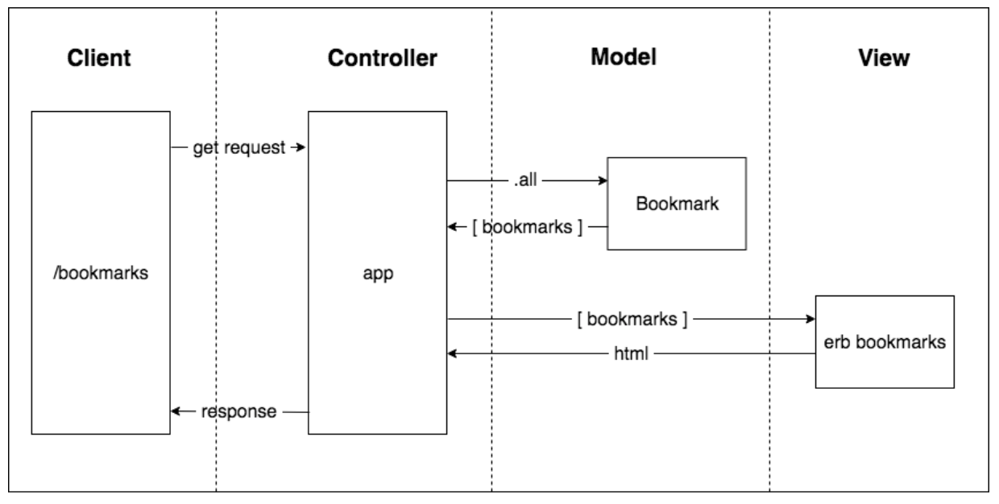

# Week 4 Goals 

#### By the end of the week all developers can:

- Build a simple web app with a database
- Follow an effective debugging process for database applications
- Explain the basics of how databases work (e.g. tables, SQL, basic relationships)

## Daily Goals 
### Monday 04 of May 2020

## Morning Goals 

- Code Review for the weekend challenge.
- Attend week 4 *kick off*. **Database** work shop. 
- Set a working plan for the new week

##### Plan:

- Review weekend challenge in pair
- Set goals for the new week
  
**Process:** 

Main focuses for this week

- Agile and TDD
- Engineering and 'Dev Recipes'
- Databases
- Tooling

**What I've Learned:**

Code Review for the weekend [**RPS Challenge:**](https://github.com/EdAncerys/rps-challenge)

**Plan:** Peer code review of the weekend challenge. Will be reviewing and getting a feedback to Gareth's code.

**Process:**   
- Start with making an appreciation about Gareth's code.
- Write at least one piece of constructive feedback.
- Spend time implementing those changes.

**What I've learned:**  

> Can redirect user to different view depending on outcome by adding simple logic to the controller:

```rb
 post '/choice_selected' do
    @game = Game.instance
    @game.current_player.choice = params[:choice]
    redirect '/end_game' if @game.all_players_selected?
    # Code continues 
```

## Afternoon Challenges  

*Practice pairing and building Web-app.*  
[**"Bookmark Manager"**](https://github.com/EdAncerys/bookmark-manager)

**Plan:** Pair with Marius and keep working on the afternoon challenge for the week - *"Bookmark Manager".*

**Process:**

- Creating User Stories. Domain model for it as per bellow: 

<p align="center">
      
    *Domain Model for Bookmark App* 
</p>

- Set up **Sinatra with RSpec and Capybara**
Adding feature test for view: 

```rb
feature 'Viewing bookmarks' do
  scenario 'visiting the index page' do
    visit('/')
    expect(page).to have_content "Bookmark Manager"
  end
end
```
Setting up **controller** (`app.rb`) and route for view.
- Next user story leads to have bookmarks in the view. Adding feature test to test drive our code:

```rb
# in spec/features/viewing_bookmarks_spec.rb

feature 'Viewing bookmarks' do
  scenario 'A user can see bookmarks' do
    visit('/bookmarks')

    expect(page).to have_content "http://www.makersacademy.com"
    expect(page).to have_content "http://www.destroyallsoftware.com"
    expect(page).to have_content "http://www.google.com"
  end
end
```
After adding array directly to the controller appropriate route we create our view by adding following html code:

```rb
<!-- in views/bookmarks/index.erb -->

<ul>
  <% @bookmarks.each do |bookmark| %>
    <li><%= bookmark %></li>
  <% end %>
</ul>
```
Ability to have all bookmarks displayed we can write our feature tests again to test drive our code as follows:  

```rb
require 'bookmark'

describe Bookmark do
  describe '.all' do
    it 'returns all bookmarks' do
      bookmarks = Bookmark.all

      expect(bookmarks).to include("http://www.makersacademy.com")
      expect(bookmarks).to include("http://www.destroyallsoftware.com")
      expect(bookmarks).to include("http://www.google.com")
    end
  end
end
```
Now that we have this class, we can require it in app.rb, which becomes:

```rb
require 'sinatra/base'
require './lib/bookmark'

class BookmarkManager < Sinatra::Base
  get '/bookmarks' do
    @bookmarks = Bookmark.all
    erb :'bookmarks/index'
  end

  run! if app_file == $0
end
```

- Setting database with **PostgreSQL** to store bookmark list. To full-fill our next user story we have to set up `psql` database by running the following command in terminal(Mac OS):

```
brew install postgresql
```
PostgreSQL is a database management service. It's handy to keep PostgreSQL running 'in the background'. This command will start PostgreSQL in the background and restart it when you login:

```
$ brew services start postgresql
```
To start psql, type psql <database name> into a Terminal, where <database name> is the name of the database you want to interact with.

```
$ psql postgres
postgres=#
```
Create a database using SQL:

```
postgres=# CREATE DATABASE "your_user_name_here";

```

Listing all database tables:

```
postgres=# \l
```

- To create new database we run the following command:

```
admin=# CREATE DATABASE DATABASE_NAME;
```
As we have now database created we can connect to it and create tables to store data by doing the following:

```
admin=# \c bookmark_manager;
```
We're going to make a bookmarks table that will store bookmarks from our application. We can use SQL commands from psql:

```
bookmark_manager=# CREATE TABLE bookmarks(id SERIAL PRIMARY KEY, url VARCHAR(60));
```

- **Manipulating Table data**.  
Using `INSERT` to add data to the table.

```
bookmark_manager=# INSERT INTO bookmarks VALUES(1, 'http://www.makersacademy.com');
```

 Using `SELECT` to query data:
 
 ```
 bookmark_manager=# SELECT * FROM bookmarks;
 ```
 Using `DELETE` to delete data 
 
 ```
 DELETE FROM bookmarks WHERE url = 'http://www.twitter.com';
 ```
 Using `UPDATE` to update data
 
 ```
 UPDATE bookmarks SET url = 'http://www.destroyallsoftware.com' WHERE url = 'http://www.askjeeves.com';
 ```
- Interacting with PostgreSQL from Ruby by adding psql `gem` to *Gemfile*:

```rb
# Inside Gemfile

source "https://rubygems.org"

gem 'pg'
gem 'sinatra'

gem 'capybara', group: :test
gem 'rspec', group: :test
```

- **Connecting to the database**. This can be done by adding the following to *Bookmark* class:

```rb
# in lib/bookmark.rb

require 'pg'

class Bookmark
  def self.all
    connection = PG.connect(dbname: 'bookmark_manager')
    result = connection.exec('SELECT * FROM bookmarks')
    result.map { |bookmark| bookmark['url'] }
  end
end
```

**What I've Learned:**

> **What is a database?** A database is simply organised part of a filesystem. It's optimised for storing and retrieving data.

> **Is Postgres a database?** A common database system for modern web development is called PostgreSQL. PostgreSQL is actually a server that runs a database. Therefore, it can be started, stopped, and interacted with through an interface, psql.

> To start psql, type psql <database name> into a Terminal, where <database name> is the name of the database you want to interact with.
 ```
$ psql postgres
postgres=#
```
> The spec/spec_helper.rb is automatically executed whenever you run rspec (see your .rspec for why). In the Spec Helper, you can configure RSpec. You can make something happen before every spec with the following:
```rb
config.before(:each) do
  # Whatever you put here will happen before each spec runs.
end
```


