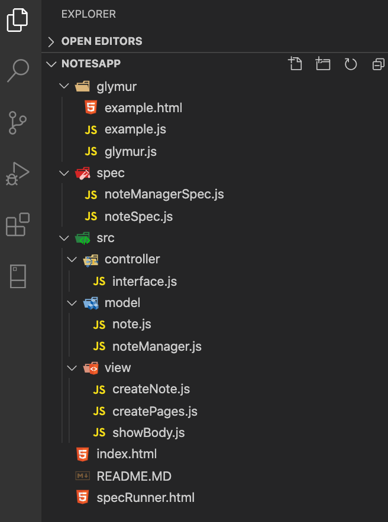

fetchingrequestslisteners# Week 7 Goals

#### By the end of the week all developers can:

- Build a front-end app in Javascript
- Work competently in Javascript
- Reason about asynchronous behaviour in Javascript

This week is analogous to week 2 in that developers will be wrestling with some underlying language concepts that are not well understood (by Makers).

Most of the work and interventions we have run historically are meant to 'de-magic' Javascript and force developers to confront the pieces they are glossing over in an attempt to get work done.

## Daily Goals
### Tuesday 26 of May 2020

## Morning Goals

- Code Review for the weekend **Bowling** challenge.
- Attend week 7 *kick off*.
- Set a working plan for the new week

##### Plan:

- Review weekend challenge in pair. Will be reviewing Jo's code.
- Set goals for the new week

### Weekly Morning Goals

- Events and event handlers.
- Manipulating the Document Object Model (DOM).
- Ajax.
- Frontend templating.
- Frontend routing.

#### Explain events and event handlers.

**Plan:**

- Perform research online individually.  
- Describe what **events and event handlers are** and it's usages.
- Summarize and give some practical example.

**Process:**

#### Events

In programming, an event is an action that occurs as a result of the user or another source, such as a mouse click. An event handler is a routine that deals with the event, allowing a programmer to write code that will be executed when the event occurs.

#### Registering onevent handlers

The onevent handlers are properties on certain DOM elements to manage how that element reacts to events. Elements can be interactive (links, buttons, images, forms, and so forth) or non-interactive (such as the base <body> element). HTML Events are actions like:

- Web page has finished loading
- An input field was changed
- Being clicked
- Detecting pressed keys
- Getting focus

The on-event handler is usually named with the event it reacts to, like onclick, onkeypress, onfocus, etc.

#### Events on the Web

Another example of an event is a user clicking on a button within a web page. This action creates what is known as a "click" event. JavaScript could then be used to program a reaction to the event, for instance, you could use the onclick event handler shown in the following box:
```js
<form action="#" method="post">
<input type="button" value="Click for a Message" onclick="window.alert('Hello!');">
</form>
```
Or by setting the corresponding property from JavaScript:
```js
document.querySelector("button").onclick = function(event) { … }.
```

**What I've Learned:**

> The Web platform provides several ways to be notified of DOM events. Two common approaches are addEventListener() and the specific onevent handlers.  
> HTML events are "things" that happen to HTML elements.  
> When JavaScript is used in HTML pages, JavaScript can "react" on these events.

## Afternoon Challenges  

*Practice pairing and building Web-app.*  
["Notes App"](https://github.com/EdAncerys/Notes-App)

**Plan:** Pair with Dec, Marja and Catriona and keep working on the afternoon challenge for the week - *"Notes App".*

**Process:**

## Writing a frontend, single page app using only pure JavaScript (further JS)

### Learning objectives

#### Primary goal

By the end of the week, the goal is to be able to answer "yes" to the week's primary question:

Can you write a frontend, single page app using only pure JavaScript?

As part of this primary goal, a sub-goal should be that you are able to explain and give an example of asynchronous behaviour in Javascript.

### User Stories
```
As a programmer
I can see a list of my notes, where each note is abbreviated to the first 20 characters
So I can find the one I want

As a programmer
I can create a new note
So I can record something I need to remember

As a programmer
I can see the full text of an individual note on its own page
So I can see all the information in the note
```

As a groupe first thing been to discus an approach and break it down to the smaller chunks User stories to tackle.

That is what we came up with after discussion:

## Approach

### View notes 20 characters each

- [x] object that holds notes
- [x] instantiate notes
- [x] retrieve list of notes
- [x] note function that returns first 20 characters of the note body
- [x] a way to get those 20 characters onto the page as an element
- [x] create a list of HTML elements as links on the page
- [x] updates every time new note is added

### Create a note

- [x] generate text box element
- [x] generate a submit button
- [x] get text from text box and put it into a element on the page
- [x] new note object
- [x] clear text element box when note is generated
- [x] stop empty notes being added

### Create note Manager
- [x] holds an array of note objects
- [x] create addNote method to add note objects to array
- [x] create getNote method to retrieve a note

### View full note

- [x] clicking link suppresses default event and triggers custom event
- [x] retrieve particular note's full text
- [x] generate HTML element that holds full note text

**What I've Learned:**

> Importance of taking right and thoughtful approach to the problem/challenge is well forth an effort as its helps to stay on track during the development process and keep your self on track without deviating from the main problem.

## Daily Goals
### Wednesday 27 of May 2020

## Morning Goals

#### Explain the **JavaScript module pattern**.

**Plan:**

- Perform research online individually.  
- Describe what **JavaScript module pattern is** and it's usages.
- Summarize and give some practical example.

**Process:**

# JavaScript module pattern

A design pattern to encapsulate your JavaScript code.

## Immediately Invoked Function Expression (IIFE)

Let's start by talking about a part of the module pattern: the Immediately Invoked Function Expression (or IIFE, pronounced "iffy").  At its simplest, it looks like this:

```js
function printHi() {
  console.log("hi");
};

printHi();
```

This code does the same thing the IIFE does.  But it's more verbose. And it creates an unnecessary variable, `printHi` that no one needs.

### Why?

It's pointless to wrap just a call to `console.log` in an IIFE.  We use IIFEs to hide variable and function declarations.  Calling `console.log` doesn't declare any variables, so it doesn't need to be wrapped in an IIFE.

Imagine we wanted to formulate a more complex greeting than just `hi`.

```js
(function () {
  var EXCLAMATION_MARK_COUNT = 5

  function exclaim(string) {
    return string + "!".repeat(EXCLAMATION_MARK_COUNT);
  };

  console.log(exclaim("hi"));
})();
```

Using an IIFE to wrap all this code keeps the details of creating the greeting private. It means none of the rest of the code can access any variables or functions inside the IIFE.  Look what happens when we try to use `exclaim` and `EXCLAMATION_MARK_COUNT` outside the IIFE:

```js
(function () {
  var EXCLAMATION_MARK_COUNT = 5

  function exclaim(string) {
    return string + "!".repeat(EXCLAMATION_MARK_COUNT);
  };
})();

// throws a ReferenceError
exclaim("hi");

// would throw a ReferenceError, if not for the ReferenceError thrown
// by the previous line
console.log(EXCLAMATION_MARK_COUNT);
```

## Using the module pattern in the browser

The module pattern is basically just an IIFE.  But it uses a bit of extra code to export (or expose, or make available to the outside, or show) functions and variables that are part of the public interface of the module.

Here is a tiny module:

```js
(function(exports) {
  var EXCLAMATION_MARK_COUNT = 5

  function exclaim(string) {
    return string + "!".repeat(EXCLAMATION_MARK_COUNT);
  };

  exports.exclaim = exclaim;
})(this);
```

To explore this code, let's try and use the exclaim function:

```js
(function(exports) {
  var EXCLAMATION_MARK_COUNT = 5

  function exclaim(string) {
    return string + "!".repeat(EXCLAMATION_MARK_COUNT);
  };

  exports.exclaim = exclaim;
})(this);

// prints "hi!!!!!"
console.log(exclaim("hi"));

// throws a ReferenceError
console.log(EXCLAMATION_MARK_COUNT);
```

So we can access `exclaim`, but `EXCLAMATION_MARK_COUNT` is hidden. We've made available the function we want people to use, but hidden some implementation details that we don't want to bother them with.  We've also prevented our hidden variables from clashing with variables in the rest of our program.  For example, we could have two modules, each of which define and keep private their own `EXCLAMATION_MARK_COUNT`.

### How does `exports` work?

How have we made `exclaim` available? Grab the code and paste it into your browser console.

Use `console.log` to print the data stored in variables like `this` and `exports`.  Follow the flow of this data through the program.  Some points to help you:

* Notice how the value of `this` is `window`, the place where all globals are stored.

### What if one module needs to require another module?

In the rewrite below, the programmer wants to abstract out the code that can repeat the exclamation marks.  They create a new module, `repeat`.

```js
// repeat.js

(function(exports) {
  function repeat(string, count) {
    return string.repeat(count);
  };

  exports.repeat = repeat;
})(this);
```

```js
// exclaim.js

(function(exports) {
  var EXCLAMATION_MARK_COUNT = 5;

  function exclaim(string) {
    return string + repeat("!", EXCLAMATION_MARK_COUNT);
  };

  exports.exclaim = exclaim;
})(this);
```

This works great.  `repeat` is available because it's a global variable, so all is well.

### A module that doesn't include any other modules

This version of `exclaim` contains the repeat functionality.

```js
(function(exports) {
  var EXCLAMATION_MARK_COUNT = 5

  function exclaim(string) {
    return string + "!".repeat(EXCLAMATION_MARK_COUNT);
  };

  exports.exclaim = exclaim;
})(this);
```

This version that we wrote for the browser works perfectly, without any changes, in Node.js.  Look:

```js
// exclaim-test.js

var exclaim = require("./exclaim").exclaim;

if (exclaim("hi") !== "hi!!!!!") {
  throw new Error("Exclaiming hi should equal hi!!!!!");
} else {
  console.log(".");
}
```

### A module that requires other modules

This version of the `exclaim` module breaks out the `repeat` functionality into a separate module.

```js
// repeat.js

(function(exports) {
  function repeat(string, count) {
    return string.repeat(count);
  };

  exports.repeat = repeat;
})(this);
```

```js
// exclaim.js

(function(exports) {
  var EXCLAMATION_MARK_COUNT = 5;

  function exclaim(string) {
    return string + repeat("!", EXCLAMATION_MARK_COUNT);
  };

  exports.exclaim = exclaim;
})(this);
```

This version of the `exclaim` module won't work in Node.js.  The behaviour of the browser that makes `repeat` available as a global doesn't work in Node.js

Here is one way we can rewrite `exclaim` to support Node.js and the browser.  There are other ways, but this one is simple and clear.

```js
// exclaim.js

(function(exports) {
  var EXCLAMATION_MARK_COUNT = 5;

  function exclaim(repeat, string) {
    return string + repeat("!", EXCLAMATION_MARK_COUNT);
  };

  exports.exclaim = exclaim;
})(this);
```

We have injected the `repeat` function into `exclaim`.  To support this, here are the slightly rewritten `app.js` and Node.js test file `exclaim-test.js`:

```js
// app.js

console.log(exclaim(repeat, "howdy"));
```

```js
// exclaim-test.js

var repeat = require("./repeat").repeat;
var exclaim = require("./exclaim").exclaim;

if (exclaim(repeat, "hi") !== "hi!!!!!") {
  throw new Error("Exclaiming hi should equal hi!!!!!");
} else {
  console.log(".");
}
```

**What I've Learned:**

> JavaScript module pattern is a design pattern to encapsulate your JavaScript code.
This can be done by wrapping function in another function and expose variables we want by doing:

```js
var name = ‘ed’

function(context) {
	var name = ‘notEd’ // Encapsulated variable that can not be accessed outside the function

	function sayGoodMorning(name) {
		return name
	}
	context.sayGoodMorning = sayGoodMorning // context variable & what CAN BE EXPOSED !!!
})(this) // passing to window object

name // returns 'ed'
sayGoodMorning() // returns 'notEd'
```

## Afternoon Challenges  

*Practice pairing and building Web-app.*  
["Notes App"](https://github.com/EdAncerys/Notes-App)

**Plan:** Pair with Dec, Marja and Catriona and keep working on the afternoon challenge for the week - *"Notes App".*

**Process:**

# Writing tests without a testing library

## What is a test?

A test does two things:

1. Sets some conditions up.
2. Checks that some things are true.

## What are testing libraries for?

A testing library supplies:

1. Mocking functions to help isolate the part of the code being tested.
2. Assertion functions that help check that specific things are true.
3. A standard way to describe what a test or group of tests is doing.
4. A way to organise tests.
5. An easy way to run lots of tests.

## Writing tests without a testing library

In order to test our JS methods and code we had to write our own test framework. Below is a walkthrough of test framework we been using to test our code.

Starting from the beginning beforeEach syntax could be added as follows:
```js
var beforeEachFunction = function() {}
function beforeEach(callback) {
  beforeEachFunction = callback;
}
```
As we follow simmilar aproach to **Jasmine** testing framework we desided to add similar functionality and approach. Describe block functionality could be added by adding following code to testing framework:
```js
function describe(description, callback) {
  incrementPrintDepth()
  printMessage(description)
  callback()
  decrementPrintDepth()
  printDivider()
}
```
Same applies to `it` block and this can be added:
```js
function it(description, callback) {
  incrementPrintDepth()
  beforeEachFunction();
  printMessage(description)
  callback()
  decrementPrintDepth()
}
```
To add matchers we want to implement in our test framework we defining Result function:
```js
function Result() {
  this.assertion = undefined
}
```
Now to define matchers we want to use we can add them by assigning to the function as per below:

#### `toEqual` matcher:
```js
Result.prototype.toEqual = function(expectation) {
  if(this.assertion === expectation) {
    passed()
  } else {
    failed(function() {
      printMessage(`Expected ${this.assertion} to equal ${expectation}`)
      printMessage(`But equals ${this.assertion}`)
    }.bind(this))
  }
}
```
#### `toBe` matcher:
```js
Result.prototype.toBe = function(expectation) {
  if(typeof this.assertion !== 'boolean' || typeof expectation !== 'boolean') {
    return matcherError(function() {
      printMessage('toBe can only be used with booleans')
    })
  }
  if(this.assertion === expectation) {
    passed()
  } else {
    failed(function() {
      printMessage(`Expected ${this.assertion} to be ${expectation}`)
      printMessage(`But it was ${this.assertion}`)
    }.bind(this))
  }
}
```

**What I've Learned:**

> Learned about test frameworks and deeper understanding how it all works under the hood. After writing basic testing framework that helps to test JS code have more confidence in my knowledge and better understanding of test frameworks in general.

## Daily Goals
### Thursday 28 of May 2020

## Morning Goals

#### Explain how to **Manipulate the Document Object Model (DOM).**.

**Plan:**

- Perform research online individually.  
- Describe what **Document Object Model (DOM) is** and it's usages.
- Summarize and give some practical example.

**Process:**

The DOM (Document Object Model) is an interface that represents how your HTML and XML documents are read by the browser. It allows a language (JavaScript) to manipulate, structure, and style your website. After the browser reads your HTML document, it creates a representational tree called the Document Object Model and defines how that tree can be accessed.

#### Advantages

By manipulating the DOM, you have infinite possibilities. You can create applications that update the data of the page without needing a refresh. Also, you can create applications that are customisable by the user and then change the layout of the page without a refresh. You can drag, move, and delete elements.

#### Most common elements

- Document: It treats all the HTML documents.
- Elements: All the tags that are inside your HTML or XML turn into a DOM element.
- Text: All the tags’ content.
- Attributes: All the attributes from a specific HTML element. In the image, the attribute class=”hero” is an attribute from the <p> element.

### Manipulating the DOM

#### Methods

The DOM has a lot of methods. They are the connection between our nodes (elements) and events.

getElementById()

This method returns the element that contains the name id passed. As we know, id’s should be unique, so it’s a very helpful method to get only the element you want.

start: id passed. And in case we do not have any id with that specific name, it returns null.
```js
var myStart = document.getElementsById('start');
myStart: Our variable name that looks similar to our id passed.
```

getElementsByClassName()

This method returns an HTMLCollection of all those elements containing the specific name class passed.

.container: our class passed. In case we do not have any class with that specific name, it returns null.
```js
var myContainer = document.getElementsByClassName('container');
myContainer: Our variable name that looks similar to our class passed.
```

getElementsByTagName()

This works the same way as those methods above: it also returns an HTMLCollection, but this time with a single difference: it returns all those elements with the tag name passed.

button: tag name that we want to get.
```js
var buttons = document.getElementsByTagName('button');
buttons: Our variable name that looks similar to our tag name passed.
```

querySelector()

It returns the first element that has the specific CSS selector passed.
```js
var resetButton = document.querySelector('#reset');
resetButton: Our variable name that looks similar to our selector passed.

#reset: selector passed, and if you don’t have any selector that matches it returns null.
```
querySelectorAll()

Very similar to the querySelector() method, but with a single difference: it returns all the elements that match with the CSS selector passed. The selector should also follow the CSS syntax. In case you do not have any selector, it returns null.
```js
var myButtons = document.querySelector('#buttons');
myButtons: Our variable name that looks similar to our selectors passed.

#buttons: selector passed, if you don’t have any selector that matches it returns null.
```
createElement()

Creates a new element in your HTML page
```js
var p_element = document.createElement('p');
```

setAttribute()

Lets you set new attributes for elements HTML.
```js
p_element.setAttribute('id', 'note-body')
```

### Events

The DOM elements have methods, but they also have events. These events are responsible for make interactivity possible in our page. **Events are also methods.**

`click`

One of the most used events is the click event. When the user clicks on a specific element, it will realise some action.
```js
myStart.addEventListener('click', function(event) {
// Do something here.
}, false);
```
The addEventListener() parameters are:

- The type of the event that you want (in this case ‘click’).
- A callback function
- The useCapture by default is false. It indicates whether or not you want to “capture” the event.

`select`

This events is for when you want to dispatch something when a specific element is selected. In that case we’re gonna dispatch a simple alert.
```js
myStart.addEventListener('select', function(event) {
alert('Element selected!');
}, false);
```
These are some of the most commonly used events.

**What I've Learned:**

> When a web page is loaded, the browser creates a Document Object Model of the page, which is an object oriented representation of an HTML document, that acts as an interface between JavaScript and the document itself and allows the creation of dynamic web pages.  

> By manipulating the DOM, you have infinite possibilities. You can create applications that update the data of the page without needing a refresh. Also, you can create applications that are customizable by the user and then change the layout of the page without a refresh.

## Daily Goals
### Friday 29 of May 2020

## Morning Goals

#### Explain how to **Manipulate the Document Object Model (DOM).**.

**Plan:**

- Perform research online individually.  
- Describe what **asynchronous JavaScript is** and it's usages.

**Process:**

#### Synchronous JavaScript:

At its base, JavaScript is a synchronous, blocking, single-threaded language. That just means that only one operation can be in progress at a time.

Execution context (EC): is defined as the environment in which the JavaScript code is executed. By environment, I mean the value of this, variables, objects, and functions JavaScript code has access to at a particular time.

Call Stack: LIFO (Last in, First out) structure, which is used to store all the execution context created during the code execution. Items can only be added or removed at the top of the stack. As it's a single threaded language JS only has one call stack.

#### Asynchronous JavaScript:

Some tasks take longer than others and they will be blocking the call stack until they are fully executed, thats what we want to avoid.

Asynchronous callbacks:

- We can use the setTimeout method to evaluate part of our code with some delay, to give it time to load.

- 'Event loop' will look into the call stack and determine if the call stack is empty or not. If the call stack is empty, it looks into the message queue to see if there’s any pending callback waiting to be executed. If call stack is empty and there's a callback in queue it will be pushed into the top of the stack to be executed.

- The message queue also contains the callbacks from the DOM events such as click events and keyboard events. The event listener sits in the web APIs environment waiting for a certain event to happen, and when that event happens, then the callback function is placed in the message queue waiting to be executed. Again the event loop checks if the call stack is empty and pushes the event callback to the stack if it’s empty and the callback is executed.

**What I've Learned:**

> JavaScript is a single-threaded programming language which means only one thing can happen at a time. That is, the JavaScript engine can only process one statement at a time in a single thread. While the single-threaded languages simplify writing code because you don’t have to worry about the concurrency issues, this also means you can’t perform long operations such as network access without blocking the main thread. Using asynchronous JavaScript (such as callbacks, promises, and async/await), you can perform long network requests without blocking the main thread.

## Afternoon Challenges  

*Practice pairing and building Web-app.*  
["Notes App"](https://github.com/EdAncerys/Notes-App)

**Plan:** Pair with Dec, Marja and Catriona and keep working on the afternoon challenge for the week - *"Notes App".*

**Process:**

As we had to write all our code in **Java Script** only, that meant we had to learn more about **DOM** and how to manipulate it via JS.

Our `index.html` main page body had no *HTML* at all so all HTML elements could be added and created with Java Script only. That all could be achieved by adding `<script>` tag that links to JS file where we will be adding all necessary elements for our project.

#### `index.html` file:

```HTML
<!DOCTYPE html>
<html lang="en" dir="ltr">

  <head>
    <meta charset="utf-8">
    <title></title>
    <script src='src/note.js'></script>
  </head>

  <body>

    <script src='src/interface.js'></script>
  </body>
</html>
```

To achieve this we adding a function that will load when DOM is loaded. That by it self is an **event**.
Code below is after refactoring and extracting some code to separate functions for better readability:

```js
document.body.onload = function() {
  let noteHeadingElement = document.createElement('h1')
  noteHeadingElement.innerHTML = 'Notes'

  document.body.appendChild(noteHeadingElement)
  createPageOneElements()
  createPageTwoElements()
}
```
We decided to have two views to simulate and mimic page load when user trigger different events. To achieve this we added two separate `<div>` elements that will be hiding and showing up HTML elements by triggering events in **DOM** on users pick/selection.

#### Page view one
```js
function createPageOneElements() {

  let inputForm = document.createElement('form')
  inputForm.setAttribute('id', 'input-form')

  let noteBodyInput = document.createElement('textarea')
  noteBodyInput.setAttribute('rows', 8)
  noteBodyInput.setAttribute('cols', 40)
  noteBodyInput.setAttribute('id', 'text-input')

  let noteSubmissionButton = document.createElement('input')
  noteSubmissionButton.setAttribute('type', 'submit')
  noteSubmissionButton.setAttribute('value', 'Save Note')

  inputForm.appendChild(noteBodyInput)
  inputForm.appendChild(document.createElement('br'))
  inputForm.appendChild(noteSubmissionButton)

  pageOneView.appendChild(inputForm)
  document.body.appendChild(pageOneView)

  inputForm.addEventListener('submit', createNewNote)
}
```

Acordingly we have page two view created with following function:
#### Page view one
```js
function createPageTwoElements() {
  let noteBodyElement = document.createElement('p')
  noteBodyElement.setAttribute('id', 'note-body')

  let homeButton = document.createElement('button')
  homeButton.innerHTML = 'Home'
  homeButton.addEventListener('click', function(event) {
    pageTwoView.style.display = 'none'
    pageOneView.style.display = 'block'
  })
  pageTwoView.appendChild(noteBodyElement)
  pageTwoView.appendChild(homeButton)
  document.body.appendChild(pageTwoView)
  pageTwoView.style.display = 'none'
}
```
To create a single note element we created `createNewNote` function that have all functionality encapsulated in its own function:

```js
function createNewNote(event) {
  event.preventDefault()
  let inputMessage = document.getElementById('text-input').value
  if(inputMessage === '') return
  document.getElementById('text-input').value = ''
  let noteObject = new Note(inputMessage)
  let new_note = document.createElement('a')
  addShowBodyEvent(new_note, arrayOfNotes.length)
  arrayOfNotes.push(noteObject)

  new_note.setAttribute('href', '/')
  new_note.setAttribute('class', 'new-note')
  new_note.innerHTML = noteObject.preview()
  pageOneView.appendChild(new_note)
  pageOneView.appendChild(document.createElement('br'))

}
```
**What I've Learned:**

> We able to manipulate DOM via JS by creating and adding set of HTML elements either by appending them to existing elements or placing them in DOM body.
We able to trigger different events in DOM that can fire different `functions` that helps to add functionality when user take action and interacts in **UI**.
That by it self can greatly improve *user* experience add functionality to the page without reloading the page or changing route.  

## Afternoon Challenges  

*Practice pairing and building Web-app.*  
["Notes App"](https://github.com/EdAncerys/Notes-App)

**Plan:** Pair with Dec, Marja and Catriona and keep working on the afternoon challenge for the week - *"Notes App".*

**Process:**

We decided to take few final steps to complete our challenge by extracting array where we store notes in to separate model:

```js
'use strict';

class NoteManager {
  constructor() {
    this._notes = []
  }
  numberOfNotes() {
    return this._notes.length
  }
  addNote(noteObject) {
    this._notes.push(noteObject);
  }
  getNote(index) {
    return this._notes[index]
  }
}
```

And done some back end code refactoring that we felt much needed to have cleaner, more readable code.

End up having functions extracted to different files and folders that helps achieve goals above:

<p align="center">
      
    *Project file tree*
</p>

**What I've Learned:**

> Extracting code to separate functions and files helps to improve code readability and helps to keep things organised.
> We can encapsulate functions and variables and extract only what we want to be visible by doing:

```js
(function(exports) {

  const END_OF_TEST_MESSAGE = '* End Test Line *'

  function it(input, callback) {
    console.log(`Test: ${input}`)
    callback()
    console.log(END_OF_TEST_MESSAGE)
  }
  exports.it = it

})(this)
```

## Weekend Challenge: News App

You can see the whole project [News Summary Challenge](https://github.com/EdAncerys/news-summary-challenge)


Your app will grab all the headlines from the Guardian newspaper API and display them on a page. Clicking on a headline will show a summary of the article.


Technologies: You'll write a single page web app. You'll write your code in frontend JavaScript, CSS and HTML. You won't use Ruby or backend JavaScript. And, as is the theme for this week, you won't use any libraries or frameworks!

## User Stories :white_check_mark:

```
As a busy politician
I can see all of today's headlines in one place
So I know what the big stories of the day are
```

```
As a busy politician
I can click a link to see the original news article
So that I can get an in depth understanding of a very important story
```

```
As a busy politician
I can see a summary of a news article
So I can get a few more details about an important story
```

```
As a busy politician
I can see a picture to illustrate each news article when I browse headlines
So that I have something nice to look at
```

```
As a busy politician
I can read the site comfortably on my phone
Just in case my laptop breaks
```

```
As a busy politician
I can see whizzy animations in the app
To make my news reading more fun
```

## Model view

`News` |
:--- |
this.newsBody |
preview() |

`NewsData` |
:--- |
this_storedNewsData |
viewAllNews() |
getDataFromAPI() |

## Model view

<p align="center">
      
    *UI preview*
</p>

## **What I've Learned:**

Did had a chance to better understand how to manipulate **DOM** using pure JS. How to implement event listeners and how to use them to create different events in the **DOM**.

Have good understanding of how to add functionality to UI without re routing and making a get requests and benefits in doing this.

API's and fetching external data.

<br>


# Weekend Reflections

### Did you meet all of your goals you set at the start of the week?
Felt that have learned quite a few things this week starting from DOM manipulation, working in the teams and better understanding of JS

### What things do you still need to work through?
- Mocking in Javascript
- APIs

### What would you change/improve moving forward?
##### Technical:

- Breaking problems into smaller peaces and articulate to the team.

##### Personal:

* To get enough rest and finnish off coding earlier in a day

### A pat on the back
* Happy to keep on exercising daily. That gives me energy and mental ease to saty focus

<br>
