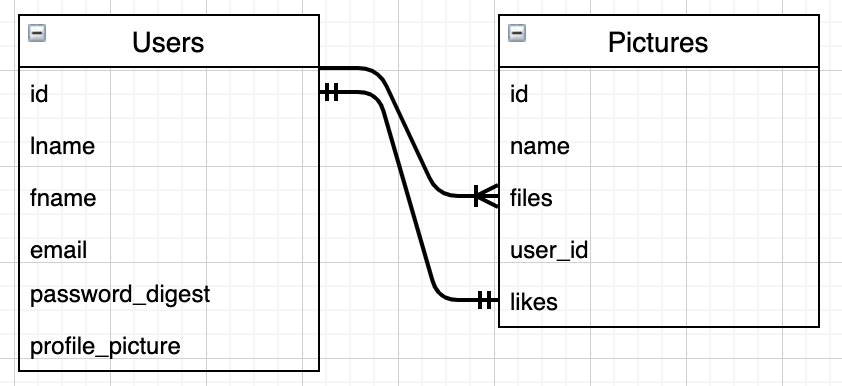

# Engineering Projects Weeks

Work in teams to produce a social media platform: Acebook, a clone of Facebook.

Each team will start with the same project seed and virtual card-wall with some initial tickets to get you started. When completed, ask the coaches for more!

At the end of the project, each team will present the great work done! They will talk through a very s
imple slide deck and do a quick demo of their project. Communicate about your learning, technical achievements, and show off your cool project to the rest of your cohort.

<br>

---

<br>

## The Honey Bunnies

Members of the Team: Gareth Woodman, Marius Brad, Asifur Rahman, Paula Darias, Catriona Bennett and Ed Ancerys

See the full project on [GitHub](https://github.com/EdAncerys/acebook-HoneyBunnies)

### Working as a group

We spend first few day mostly planning and organising the project layout:

- Daily schedule:

  - 9.30am daily standup: decide on the tasks for the day and split the work in pairs
  - 2pm lunch briefing: mood checks, working flow checks
  - 5pm retro: explain the work of the day to the other members, merge branches, update online tools, reflections

- Team roles rotation:

  - Each member of the group had a different role every day
  - Roles: Technician, Scrum Master, Leader, Scribe

- Pairs rotation:

  - Every day we worked in a different pair

- Online tools:

  - GitHub Projects
  - Google Docs
  - Slack
  - Zoom

- Knowledge Sharing:
  - Most of the technologies we were using were new to all of us.
  - Sometimes the pairs were working in different areas we focused a lot on sharing every new information we got.
  - We used a special section in our Trello Board for this: 'Learning Resources' were we saved links to interesting references organized by technology.

### The Project

**Technologies:**

- Building: Ruby, Ruby on Rails, HTML, CSS, Bootstrap, JavaScript, JQuery
- Databases: Postgres
- Travis for Automated Deployment
- Testing & coverage: Capybara, RSpec, SimpleCov, Rubocop

### PROJECT DESCRIPTION:

For this project we worked in a team to produce a social media platform.

### APP DEPLOYMENT

- We used Travis CI
- We deployed the app using Heroku, only deploys when Travis is passing
- Visit [Honey Bunnies Acebook](https://acebook-honeybunnies.herokuapp.com/)

### REQUIRED INSTRUCTIONS:

[You can find the engineering project outline here.](https://github.com/makersacademy/course/tree/master/engineering_projects/rails)

- Honey Bunnies card wall is here: [GitHub](https://github.com/EdAncerys/acebook-HoneyBunnies/projects/1)
- Honey Bunnies wiki is here: [Wiki](https://github.com/EdAncerys/acebook-HoneyBunnies/wiki)

## Installation instructions

First, clone this repository. Then:

```bash
> bundle install
> bin/rails db:create
> bin/rails db:migrate
```

## Instructions on how to run tests

```
> bundle exec rspec # Run the tests to ensure it works
```

## How to see it in operation

```
> bin/rails server # Start the server at localhost:3000
```

## Contributing to the project

Create a branch and when completed submit a pull request

## User Stories

### Completed:

```
As a User
So I can create my profile
I want to be able to sign up
```

```
As a User
So I can view my profile
I want to be able to login
```

```
As a User
So that I can keep my profile secure
I want to be able to logout
```

```
As a User - (functionality available)
So that I can express my thoughts
I want to be able to create posts
```

```
As a User
So that I can hide my embarrasment
I want to be able to delete my posts
```

```
As a User
So that I can win arguments online
I want to be able to update my posts
```

```
As a User
So that I can agree with a post
I want to be able to 'Like' it
```

```
As a User
So I can make changes to my profile
I'd like to be able to update it
```

```
As a User
So that I can start a fresh
I want to be able to delete my profile
```

### To be done:

```
As a User
So that I can show my face
I want to be able to display my profile picture
```

```
As a User
So that I can look socialiable
I want to add people as friends
```

```
As a User - (functionality available)
So that I can express my experiences
I want to be able to post photo's & links to videos (youtube etc.)
```

```
As a User
So that I can talk to a friend
I want to be able to comment on their posts
```

## Entity Relationship Diagram

### Relationships

```
User has many Posts
User has many Likes
```

```
Post has one User
Post has many Likes
```

```
Like has one User
Like has one Post
```


<br>

## **What I've Learned:**

> Learned new framework **Rails**.  
> Learned how to write features and unit tests in **Rails**. Implement Bootstrap and style UI with it.  
> Learned **Active Storage & Active Records**

<br>

# Weekend Challenge

Build a clone of Instagram

See the full project in [GitHub](https://github.com/EdAncerys/instagram-challenge)

- Building: Ruby, Ruby on Rails, HTML, CSS, Bootstrap, JavaScript
- Databases: Postgres
- Travis for Automated Deployment
- Testing & coverage: Capybara, RSpec, SimpleCov, Rubocop

<br>

## User Stories

```
As a User
So I can create my profile
I want to be able to sign up
```

```
As a User
So I can use my profile
I am able to log in
```

```
As a User
So I can leave my account secure
Im able to log out
```

```
As a User
So I can share my photos
I am able to post a photo
```

```
As a User
So I can see what people post
I am able to see all Users photos posted
```

```
As a User
So I can admire my photo collection
I am able to see my photos listed in one page
```

```
As a User
So I can admire the moment shared
I am able to see a picture in a single page
```

```
As a User
So I can hide embarrassing moments
I can delete the photos
```

```
As a User
So I can share my emotions with others
I am able to give a like
```

```
As a User
So I can express my self in words
I am able to comment on the photos
```

## Entity Relationship Diagram

### Below have Models and relationship between them:

<p align="center">
      
    *UI preview*
</p>

## **What I've Learned:**

> As per **acebook** [GitHub](https://github.com/EdAncerys/acebook-HoneyBunnies) chalenge we, as a group, been lacking of emplementing **React** in to our project. So weekend been focusing mainly on understanding and learning **React** > <br>

# Weekend Reflections

### Did you meet all of your goals you set at the start of the week?

Felt that dureing this two weeks learned quite a bit in delivering a project and working in a bigger team.

Learned comfortably how to use **Rails** and work with databases and **Active Storage**.

### What things do you still need to work through?

- React and JS

### What would you change/improve moving forward?

##### Technical:

- Have a break down on the goals during week.

##### Personal:

- Have consistant breaks and time rest and work time.
- Been lacking consistency and focus on goals past two weeks. As worked in a group personal goals been not a main priority and that can be reflected after two weeks.

### A pat on the back

- Felt more relaxed and streess free!
  <br>
